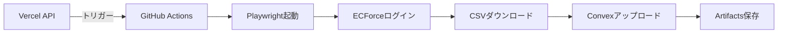

# ECForce GitHub Actions自動化セットアップガイド

## 概要
ECForceのデータ同期をGitHub Actionsで自動化します。これにより、Vercelの実行時間制限を回避し、確実にブラウザ自動化を実行できます。

## セットアップ手順

### 1. GitHub Secretsの設定

GitHubリポジトリの**Settings** → **Secrets and variables** → **Actions**で以下のシークレットを追加:

| シークレット名 | 値 | 説明 |
|---------------|-----|------|
| `ECFORCE_BASIC_USER` | mogumojp | BASIC認証ユーザー名 |
| `ECFORCE_BASIC_PASS` | （パスワード） | BASIC認証パスワード |
| `ECFORCE_EMAIL` | （メールアドレス） | ECForceログインメール |
| `ECFORCE_PASSWORD` | （パスワード） | ECForceログインパスワード |
| `CONVEX_DEPLOY_KEY` | （Convexキー） | Convexデプロイキー |
| `VITE_CONVEX_URL` | https://adjoining-alpaca-828.convex.cloud | Convex URL |

### 2. GitHub Personal Access Tokenの作成（API連携用）

1. GitHub → Settings → Developer settings → Personal access tokens → Tokens (classic)
2. **Generate new token**をクリック
3. 以下の権限を付与:
   - `repo` (Full control of private repositories)
   - `workflow` (Update GitHub Action workflows)
4. トークンをコピー

### 3. Vercel環境変数の設定（API連携用）

```bash
# GitHub Token設定
vercel env add GITHUB_TOKEN production
# トークンを貼り付け

# GitHubリポジトリ情報
vercel env add GITHUB_OWNER production
# あなたのGitHubユーザー名を入力

vercel env add GITHUB_REPO production
# marketing-tool と入力
```

## 実行方法

### 方法1: 手動実行
1. GitHubリポジトリの**Actions**タブを開く
2. **ECForce Data Sync**ワークフローを選択
3. **Run workflow**をクリック
4. デバッグモードを選択（オプション）
5. **Run workflow**ボタンをクリック

### 方法2: API経由での実行
```javascript
// フロントエンドから
await fetch('/api/ecforce/sync', {
  method: 'POST',
  headers: { 'Content-Type': 'application/json' }
})
```

### 方法3: 定期実行（自動）
- 毎日午前9時（JST）に自動実行されます
- `.github/workflows/ecforce-sync.yml`のcron設定で変更可能

## 実行結果の確認

### CSVファイルのダウンロード
1. GitHubリポジトリの**Actions**タブ
2. 実行済みのワークフローを選択
3. **Artifacts**セクションから`ecforce-csv-{実行ID}`をダウンロード

### デバッグ情報
- エラー時は自動的にスクリーンショットが保存されます
- **Artifacts**から`debug-screenshots-{実行ID}`をダウンロード

## トラブルシューティング

### エラー: Authentication failed
- GitHub Secretsが正しく設定されているか確認
- ECForceのパスワードが変更されていないか確認

### エラー: Workflow not found
- `.github/workflows/ecforce-sync.yml`が存在するか確認
- mainブランチにマージされているか確認

### エラー: GitHub API 401
- GitHub Personal Access Tokenが有効か確認
- Vercel環境変数`GITHUB_TOKEN`が設定されているか確認

## ワークフローの仕組み



## カスタマイズ

### 実行時間の変更
`.github/workflows/ecforce-sync.yml`の21行目を編集:
```yaml
# 例: 毎日午後3時に実行
- cron: '0 6 * * *'  # UTC 6:00 = JST 15:00
```

### タイムアウトの変更
27行目の`timeout-minutes`を調整:
```yaml
timeout-minutes: 60  # 最大60分
```

## セキュリティ注意事項

- GitHub Secretsは暗号化されて保存されます
- Personal Access Tokenは定期的に更新してください
- ワークフローのログに認証情報が出力されないよう注意

## サポート

問題が発生した場合は、以下を確認してください:
1. GitHub Actionsの実行ログ
2. Vercelのファンクションログ
3. このドキュメントのトラブルシューティングセクション