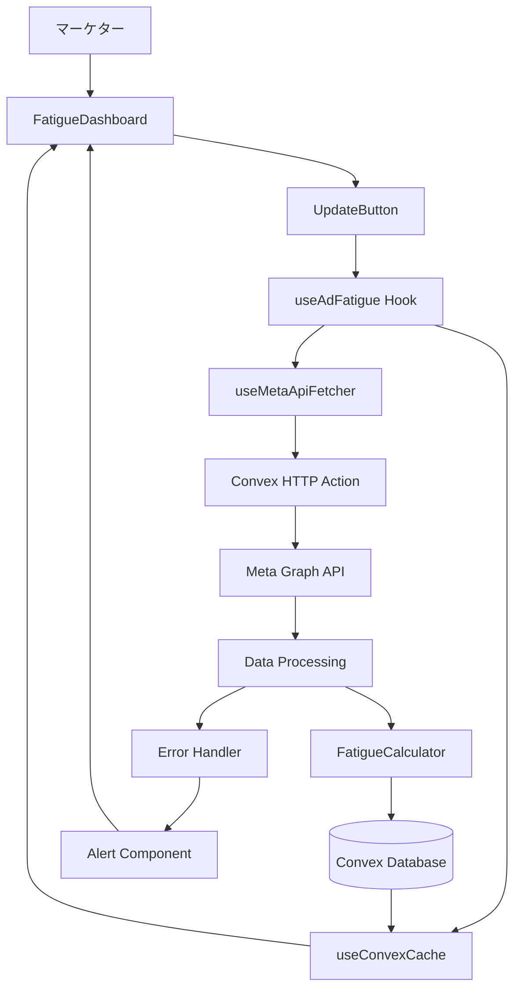
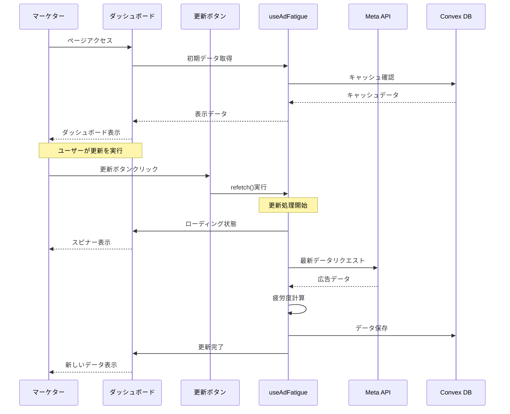
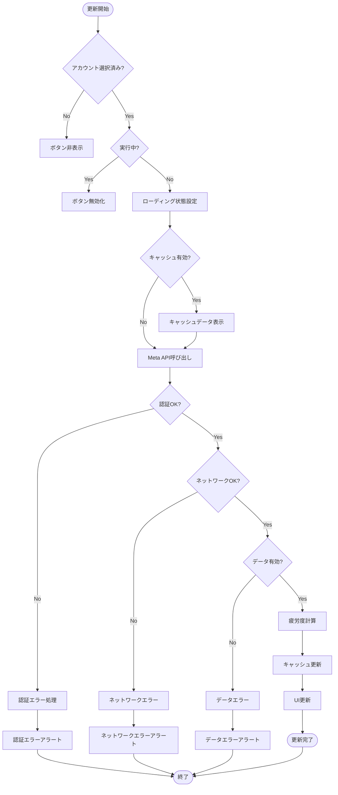
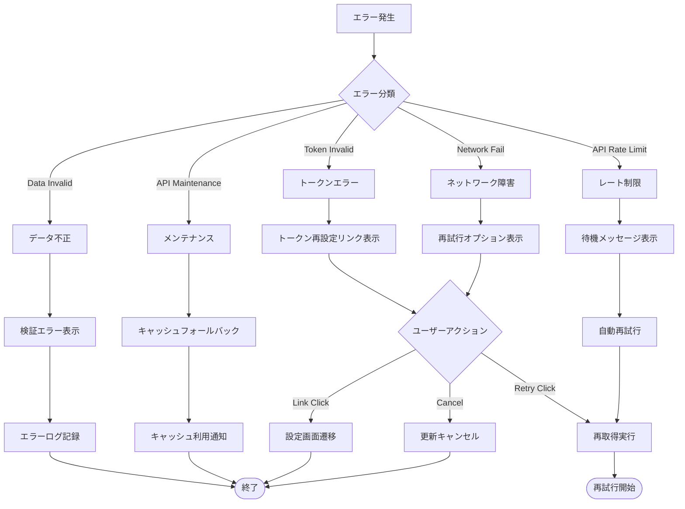
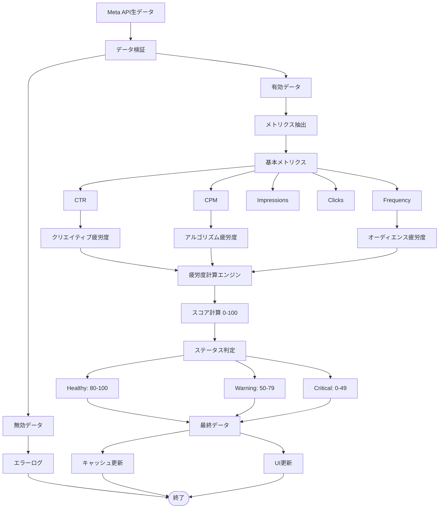
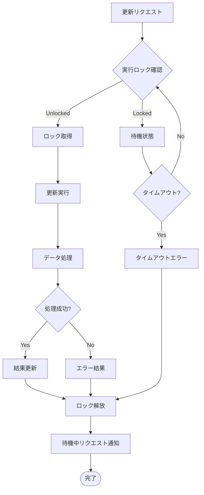
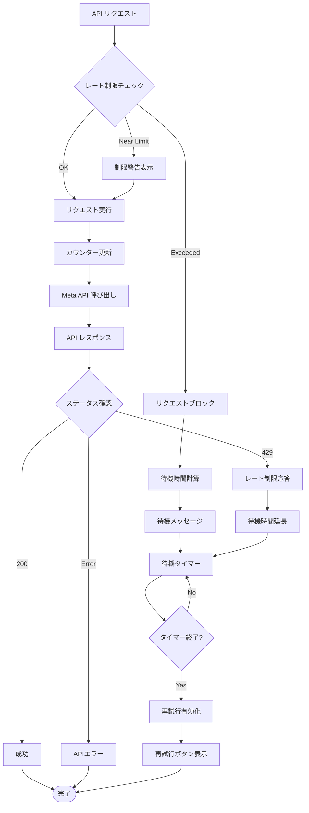

# データフロー図

## システム全体データフロー



## ユーザーインタラクションフロー



## データ更新処理フロー



## エラーハンドリングフロー



## 疲労度計算データフロー



## キャッシュ戦略フロー

```mermaid
flowchart TD
    DataRequest[データリクエスト] --> CheckCache{キャッシュ確認}
    
    CheckCache -->|Hit & Valid| CacheData[キャッシュデータ]
    CheckCache -->|Miss| FetchFresh[新規取得]
    CheckCache -->|Hit & Expired| CheckStale{Stale許可?}
    
    CheckStale -->|Yes| StaleData[期限切れデータ]
    CheckStale -->|No| FetchFresh
    
    CacheData --> SetDataSource[データソース: キャッシュ]
    StaleData --> SetDataSource
    FetchFresh --> APICall[API呼び出し]
    
    APICall --> APISuccess{API成功?}
    APISuccess -->|Yes| FreshData[最新データ]
    APISuccess -->|No| CheckFallback{フォールバック可能?}
    
    CheckFallback -->|Yes| FallbackCache[キャッシュフォールバック]
    CheckFallback -->|No| ErrorResponse[エラーレスポンス]
    
    FreshData --> UpdateCache[キャッシュ更新]
    FreshData --> SetDataSourceAPI[データソース: API]
    FallbackCache --> SetDataSourceCache[データソース: キャッシュ(Fallback)]
    
    UpdateCache --> CacheData
    SetDataSource --> DisplayData[データ表示]
    SetDataSourceAPI --> DisplayData
    SetDataSourceCache --> DisplayData
    ErrorResponse --> ErrorDisplay[エラー表示]
    
    DisplayData --> End([完了])
    ErrorDisplay --> End
```

## 同時実行制御フロー



## レート制限管理フロー

