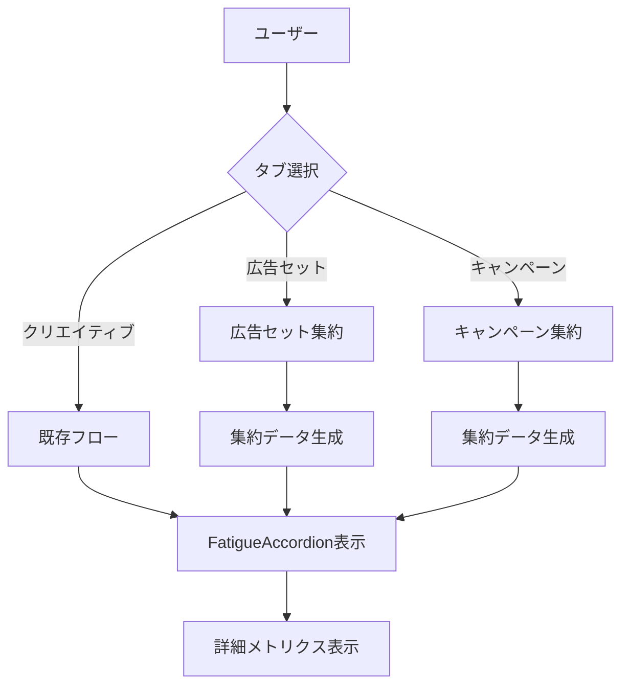
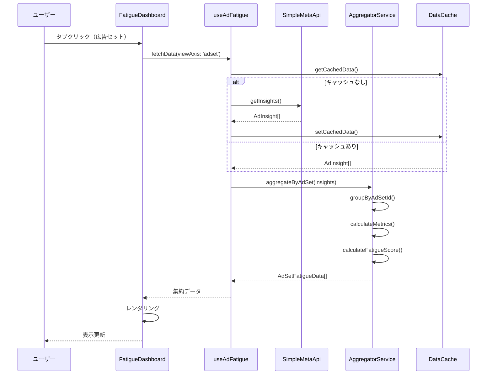
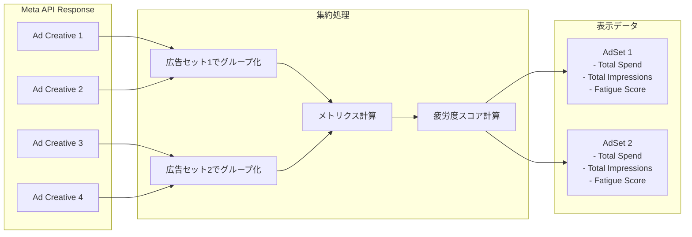
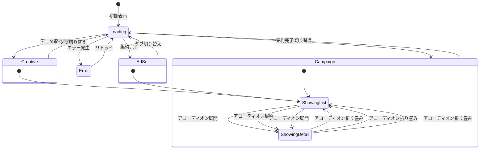
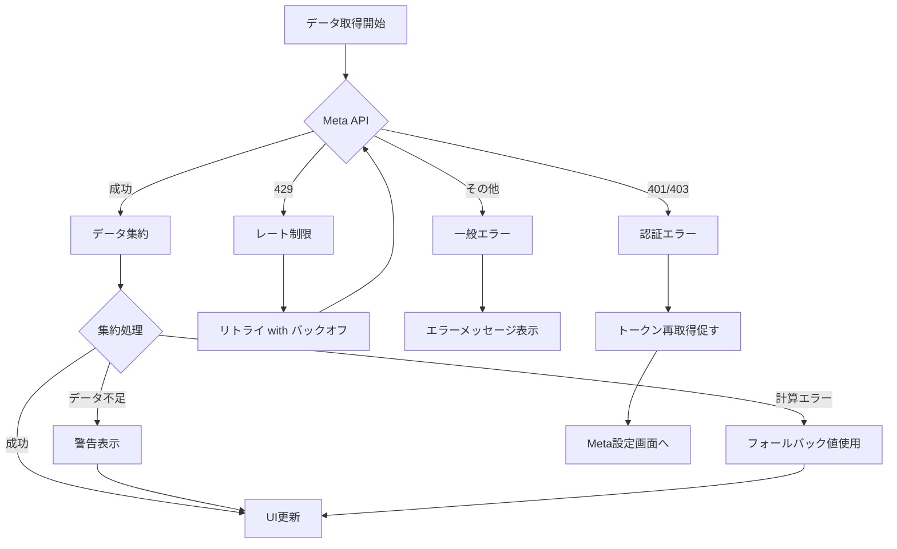
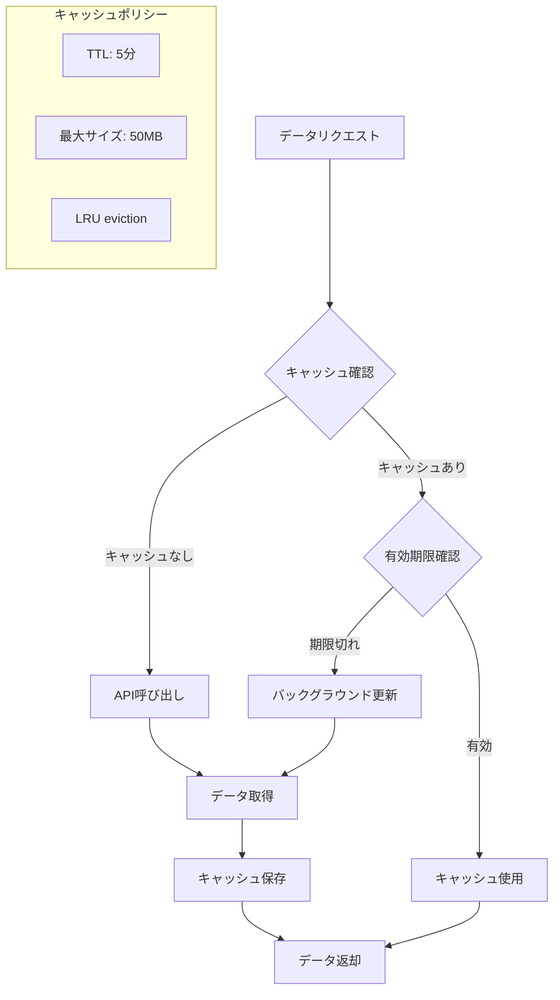

# Ad Fatigue 多軸表示機能 データフロー図

## ユーザーインタラクションフロー

```mermaid
flowchart TD
    A[ユーザー] --> B{タブ選択}
    B -->|クリエイティブ| C[既存フロー]
    B -->|広告セット| D[広告セット集約]
    B -->|キャンペーン| E[キャンペーン集約]
    
    C --> F[FatigueAccordion表示]
    D --> G[集約データ生成]
    E --> H[集約データ生成]
    
    G --> F
    H --> F
    
    F --> I[詳細メトリクス表示]
```

## データ処理フロー

```mermaid
sequenceDiagram
    participant U as ユーザー
    participant UI as FatigueDashboard
    participant Hook as useAdFatigue
    participant API as SimpleMetaApi
    participant Agg as AggregatorService
    participant Cache as DataCache
    
    U->>UI: タブクリック（広告セット）
    UI->>Hook: fetchData(viewAxis: 'adset')
    Hook->>Cache: getCachedData()
    
    alt キャッシュなし
        Hook->>API: getInsights()
        API-->>Hook: AdInsight[]
        Hook->>Cache: setCachedData()
    else キャッシュあり
        Cache-->>Hook: AdInsight[]
    end
    
    Hook->>Agg: aggregateByAdSet(insights)
    Agg->>Agg: groupByAdSetId()
    Agg->>Agg: calculateMetrics()
    Agg->>Agg: calculateFatigueScore()
    Agg-->>Hook: AdSetFatigueData[]
    
    Hook-->>UI: 集約データ
    UI->>UI: レンダリング
    UI-->>U: 表示更新
```

## データ集約フロー

```mermaid
flowchart LR
    subgraph "Meta API Response"
        A1[Ad Creative 1]
        A2[Ad Creative 2]
        A3[Ad Creative 3]
        A4[Ad Creative 4]
    end
    
    subgraph "集約処理"
        B1[広告セット1でグループ化]
        B2[広告セット2でグループ化]
        C1[メトリクス計算]
        C2[疲労度スコア計算]
    end
    
    subgraph "表示データ"
        D1[AdSet 1<br/>- Total Spend<br/>- Total Impressions<br/>- Fatigue Score]
        D2[AdSet 2<br/>- Total Spend<br/>- Total Impressions<br/>- Fatigue Score]
    end
    
    A1 --> B1
    A2 --> B1
    A3 --> B2
    A4 --> B2
    
    B1 --> C1
    B2 --> C1
    C1 --> C2
    C2 --> D1
    C2 --> D2
```

## 状態管理フロー

```mermaid
stateDiagram-v2
    [*] --> Loading: 初期表示
    Loading --> Creative: データ取得完了
    
    Creative --> Loading: タブ切り替え
    AdSet --> Loading: タブ切り替え
    Campaign --> Loading: タブ切り替え
    
    Loading --> AdSet: 集約完了
    Loading --> Campaign: 集約完了
    Loading --> Error: エラー発生
    
    Error --> Loading: リトライ
    
    state Creative {
        [*] --> ShowingList
        ShowingList --> ShowingDetail: アコーディオン展開
        ShowingDetail --> ShowingList: アコーディオン折り畳み
    }
    
    state AdSet {
        [*] --> ShowingList
        ShowingList --> ShowingDetail: アコーディオン展開
        ShowingDetail --> ShowingList: アコーディオン折り畳み
    }
    
    state Campaign {
        [*] --> ShowingList
        ShowingList --> ShowingDetail: アコーディオン展開
        ShowingDetail --> ShowingList: アコーディオン折り畳み
    }
```

## エラー処理フロー

```mermaid
flowchart TD
    A[データ取得開始] --> B{Meta API}
    B -->|成功| C[データ集約]
    B -->|401/403| D[認証エラー]
    B -->|429| E[レート制限]
    B -->|その他| F[一般エラー]
    
    D --> G[トークン再取得促す]
    E --> H[リトライ with バックオフ]
    F --> I[エラーメッセージ表示]
    
    C --> J{集約処理}
    J -->|成功| K[UI更新]
    J -->|データ不足| L[警告表示]
    J -->|計算エラー| M[フォールバック値使用]
    
    H --> B
    G --> N[Meta設定画面へ]
    L --> K
    M --> K
```

## キャッシュ戦略

```mermaid
flowchart TD
    A[データリクエスト] --> B{キャッシュ確認}
    B -->|キャッシュあり| C{有効期限確認}
    B -->|キャッシュなし| D[API呼び出し]
    
    C -->|有効| E[キャッシュ使用]
    C -->|期限切れ| F[バックグラウンド更新]
    
    D --> G[データ取得]
    F --> G
    
    G --> H[キャッシュ保存]
    H --> I[データ返却]
    E --> I
    
    subgraph "キャッシュポリシー"
        J[TTL: 5分]
        K[最大サイズ: 50MB]
        L[LRU eviction]
    end
```