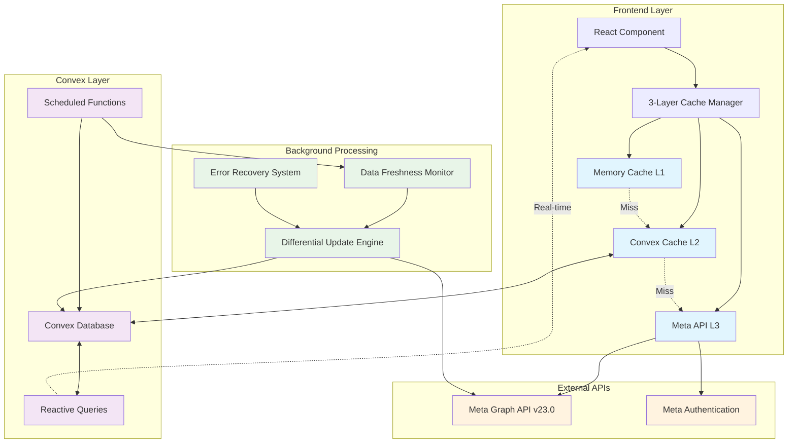
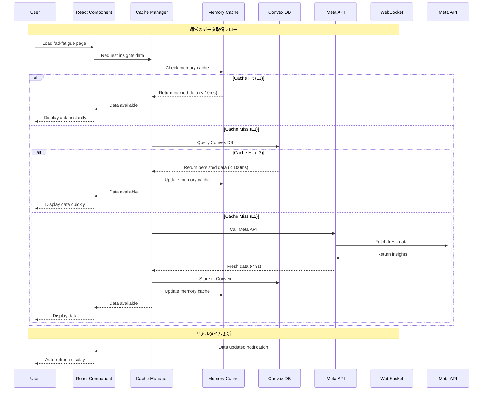
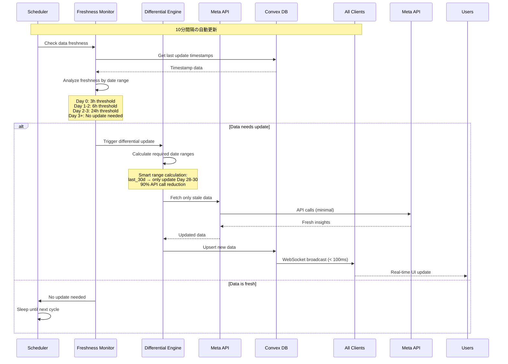
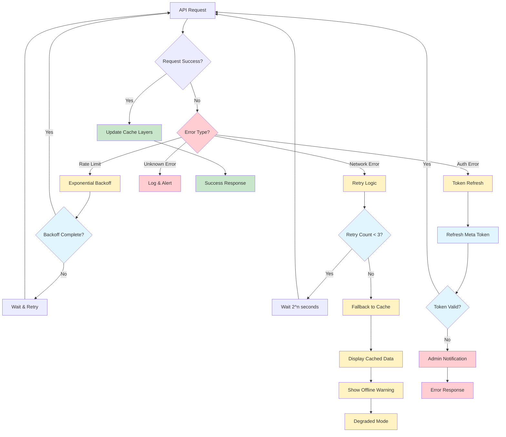
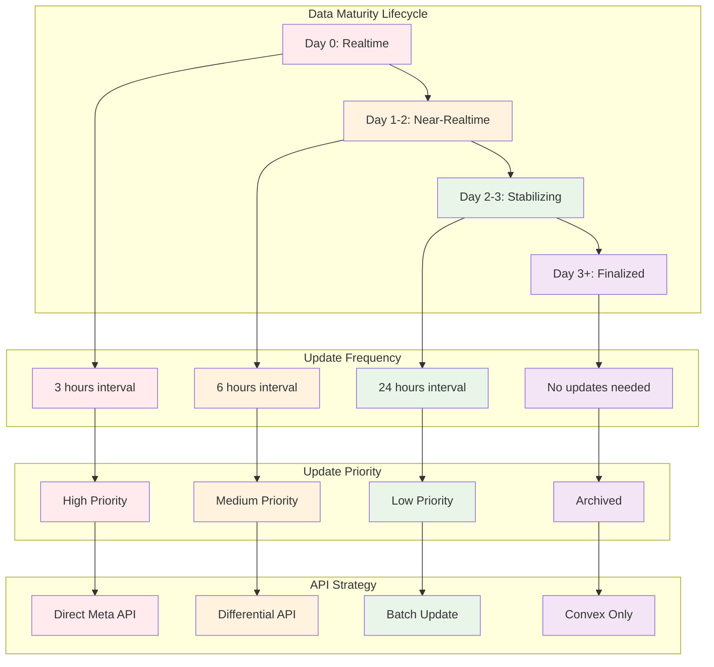
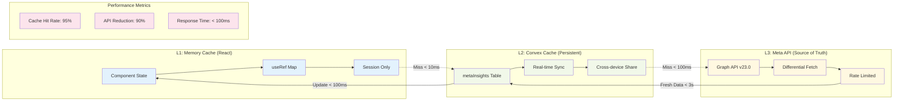
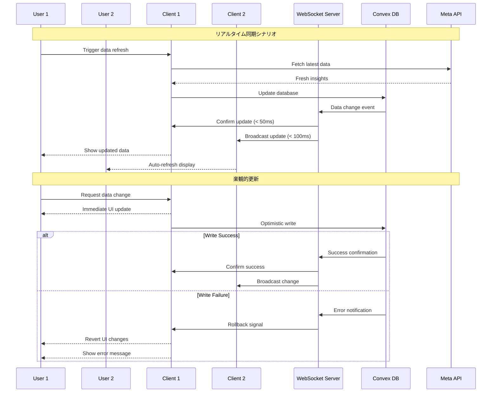
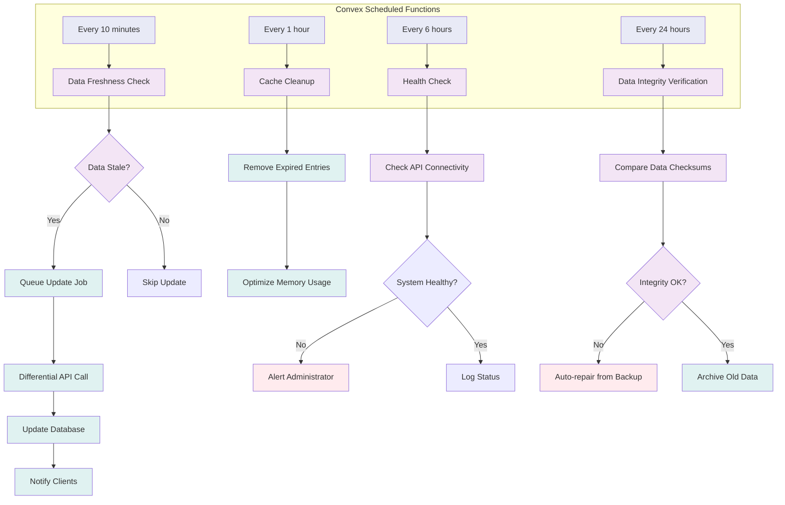

# データフロー図

## システム全体のデータフロー

## ユーザーインタラクションフロー

## 差分更新メカニズム

## エラー処理とフォールバックフロー

## データ鮮度管理フロー

## キャッシュ戦略とデータフロー

## リアルタイム同期メカニズム

## バックグラウンド処理フロー

このデータフローにより、要件で定義された全ての機能（データ一貫性、高速レスポンス、API削減、リアルタイム同期）を実現し、システム全体の信頼性とパフォーマンスを保証する。