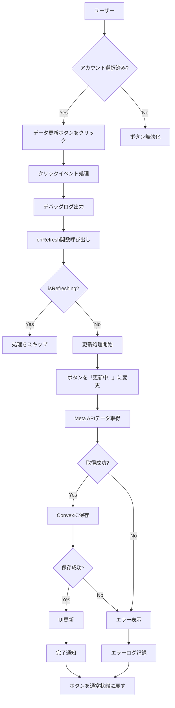
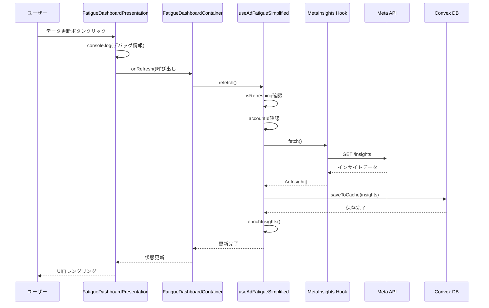
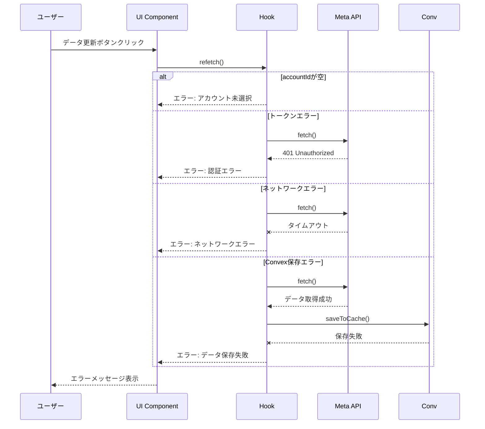
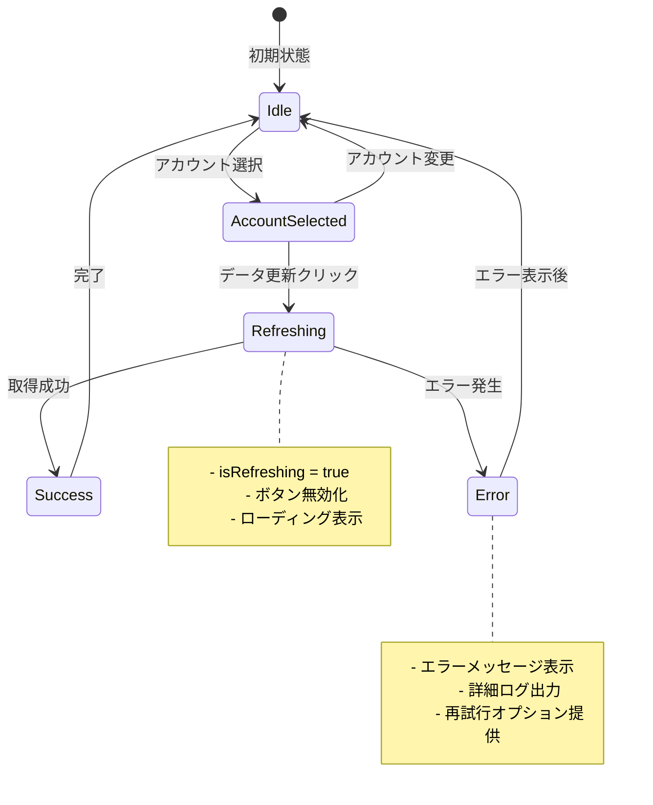

# データフロー図

## ユーザーインタラクションフロー

### データ更新の基本フロー



## データ処理シーケンス

### 正常系フロー



### エラー系フロー



## 状態管理フロー



## コンポーネント間のデータフロー

```mermaid
graph TB
    subgraph "Presentation Layer"
        A[FatigueDashboardPresentation]
        B[DataRefreshButton]
        C[AccountSelector]
        D[DataDisplay]
    end
    
    subgraph "Container Layer"
        E[FatigueDashboardContainer]
    end
    
    subgraph "Hook Layer"
        F[useAdFatigue]
        G[useAdFatigueSimplified]
        H[useMetaInsights]
        I[useInsightsCache]
    end
    
    subgraph "API Layer"
        J[SimpleMetaApi]
        K[SimpleTokenStore]
    end
    
    subgraph "Data Layer"
        L[Convex Database]
        M[Meta API]
    end
    
    A --> E
    B --> A
    C --> A
    D --> A
    
    E --> F
    F --> G
    G --> H
    G --> I
    
    H --> J
    J --> K
    J --> M
    
    I --> L
    L --> I
    
    %% Data flow
    M -.->|Raw Data| J
    J -.->|Processed Data| H
    H -.->|AdInsight[]| G
    G -.->|FatigueData[]| F
    F -.->|Display Data| E
    E -.->|Props| A
```

## エラーハンドリングフロー

```mermaid
flowchart TD
    A[エラー発生] --> B{エラータイプ}
    
    B -->|認証エラー| C[Token Expired/Invalid]
    B -->|ネットワーク| D[Network Error]
    B -->|データエラー| E[Data Processing Error]
    B -->|その他| F[Unknown Error]
    
    C --> G[認証エラーメッセージ]
    D --> H[接続エラーメッセージ]
    E --> I[データエラーメッセージ]
    F --> J[一般エラーメッセージ]
    
    G --> K[Meta API設定へのリンク表示]
    H --> L[再試行ボタン表示]
    I --> L
    J --> L
    
    K --> M[ユーザーアクション待機]
    L --> M
    
    M --> N{アクション}
    N -->|設定画面へ| O[Meta API設定]
    N -->|再試行| P[refetch()再実行]
    N -->|キャンセル| Q[通常状態に戻る]
```