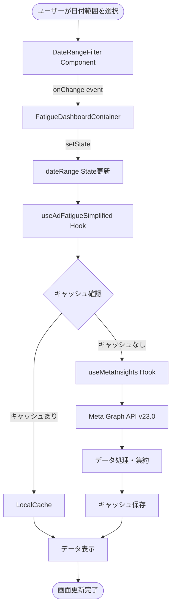
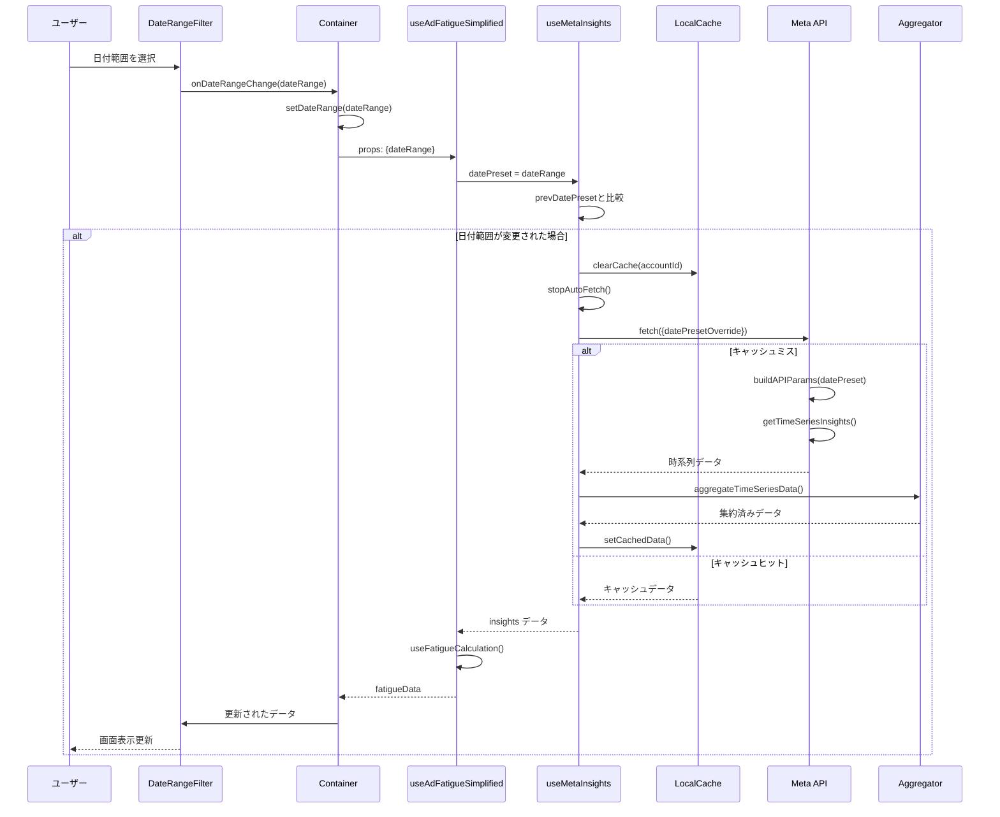
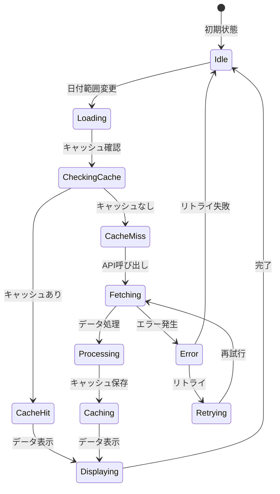
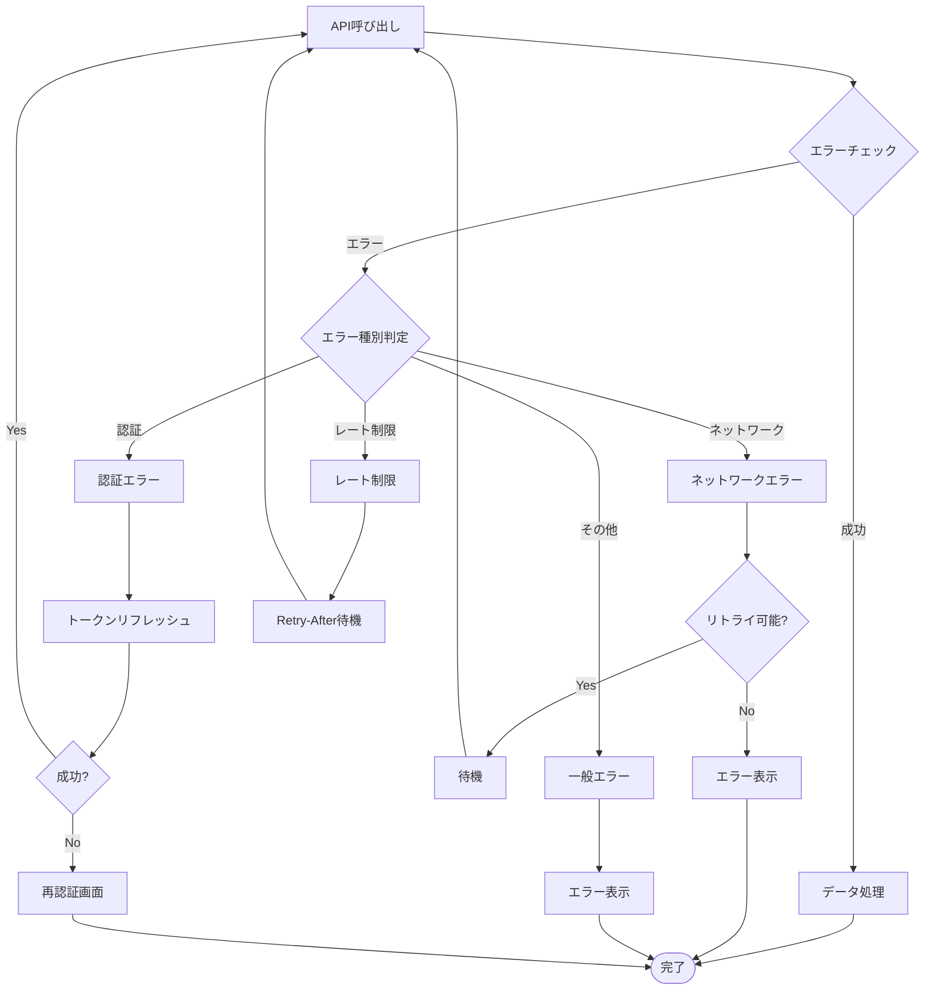
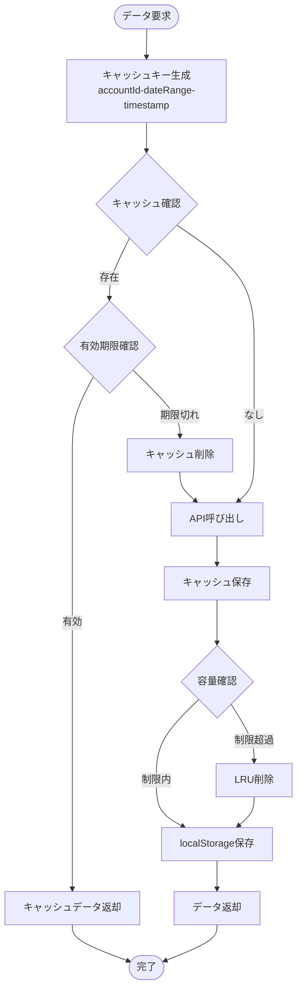
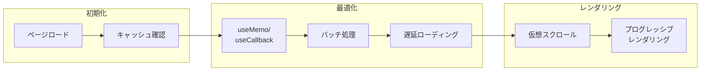
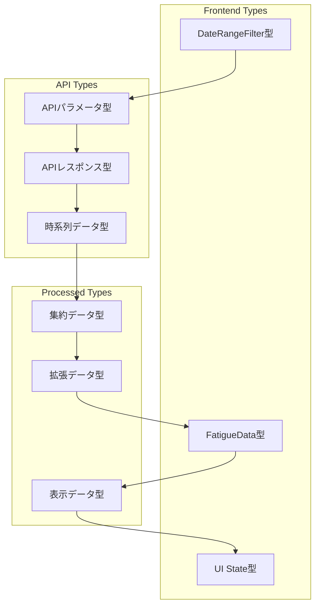

# データフロー図

## 概要

日付範囲フィルター機能におけるデータの流れを可視化します。ユーザーインタラクションから最終的な画面表示までの全プロセスを示します。

## ユーザーインタラクションフロー



## データ処理シーケンス図



## 状態管理フロー



## データ変換フロー

```mermaid
flowchart LR
    subgraph Input [入力]
        DateRange[日付範囲<br/>yesterday/last_7d/etc]
    end
    
    subgraph Transform [変換処理]
        Convert[DateRangeFilter型<br/>→<br/>APIパラメータ]
        Build[パラメータ構築<br/>date_preset or time_range]
    end
    
    subgraph API [API呼び出し]
        Request[Meta API Request<br/>time_increment=1]
        Response[日別データ配列]
    end
    
    subgraph Aggregate [集約処理]
        Group[クリエイティブ名で<br/>グループ化]
        Calc[加重平均計算<br/>CTR, CPM, CPC]
        Score[疲労度スコア計算]
    end
    
    subgraph Output [出力]
        Table[テーブル表示用<br/>データ配列]
    end
    
    DateRange --> Convert
    Convert --> Build
    Build --> Request
    Request --> Response
    Response --> Group
    Group --> Calc
    Calc --> Score
    Score --> Table
```



## エラーハンドリングフロー



## キャッシュ管理フロー



## パフォーマンス最適化フロー



## データ型の流れ



## 並行処理フロー

```mermaid
flowchart TD
    Start([複数データ要求]) --> Fork{並行処理分岐}
    
    Fork --> Task1[時系列データ取得]
    Fork --> Task2[プラットフォーム<br/>データ取得]
    Fork --> Task3[クリエイティブ<br/>情報取得]
    
    Task1 --> Promise1[Promise 1]
    Task2 --> Promise2[Promise 2]
    Task3 --> Promise3[Promise 3]
    
    Promise1 --> Wait[Promise.all()]
    Promise2 --> Wait
    Promise3 --> Wait
    
    Wait --> Merge[データ統合]
    Merge --> End([完了])
```

---

*作成日: 2024年12月*
*バージョン: 1.0*