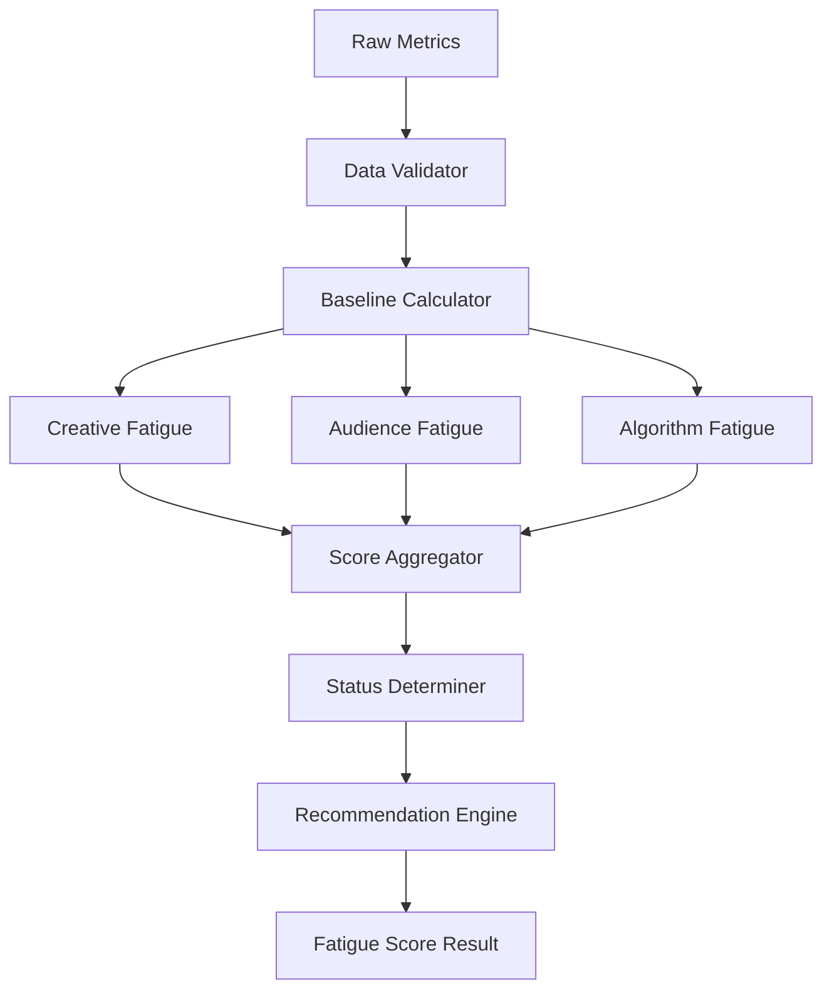

# 広告疲労度スコアリングシステム アーキテクチャ設計

## システム概要
動画クリエイティブの広告疲労度を3つの指標（クリエイティブ疲労、視聴者疲労、アルゴリズム疲労）で総合的にスコアリング（0-100）し、マーケターが直感的に広告効果を測定・判断できるシステム。Meta API及びInstagram Insightsから取得したデータを基に、リアルタイムな疲労度分析と推奨アクションを提供する。

## アーキテクチャパターン
- **パターン**: Domain-Driven Design with Event-Driven Architecture
- **理由**: 疲労度計算という複雑なドメインロジックを明確に分離し、データ更新イベントに応じてリアクティブに疲労度を再計算する必要があるため

## システム境界
### 対象範囲
- 疲労度計算エンジン（3つの指標算出）
- Meta/Instagram API連携機能
- ベースライン管理システム
- 推奨アクション生成機能
- 疲労度可視化UI

### 対象外
- 広告配信制御機能
- 予算最適化システム
- 他プラットフォーム（TikTok等）の統合

## コンポーネント構成

### フロントエンド (React/TypeScript)
- **フレームワーク**: React 18 with TypeScript
- **状態管理**: 
  - ローカル状態: Zustand (疲労度データ管理)
  - リモート状態: Convex React Hooks
  - キャッシュ: React Query (Meta API データ)
- **UI フレームワーク**: Tailwind CSS + Heroicons
- **可視化**: Recharts (疲労度トレンドグラフ)

### バックエンド (Convex)
- **フレームワーク**: Convex (TypeScript)
- **データベース**: Convex Database (Document Store)
- **イベント処理**: Convex Mutations (状態更新)
- **バッチ処理**: Convex Scheduled Functions (日次疲労度計算)
- **API統合**: Convex HTTP Actions (Meta/Instagram API)

### 外部統合
- **Meta Marketing API**: Graph API v23.0 (基本メトリクス)
- **Instagram Insights API**: Graph API v23.0 (特有メトリクス)
- **認証**: OAuth2 with Convex Auth

## レイヤー構成

### 1. Presentation Layer (React Components)
```
FatigueScoreDisplay
├── FatigueScoreCard (総合スコア表示)
├── FatigueBreakdownChart (3指標内訳)
├── InstagramMetrics (Instagram特有指標)
├── RecommendationPanel (改善推奨)
├── TrendChart (時系列トレンド)
└── AlertPanel (危険水準アラート)
```

### 2. Application Layer (React Hooks & Services)
```
useFatigueScore (メイン疲労度データ管理)
├── useFatigueCalculator (計算ロジック)
├── useBaselineManager (ベースライン管理)
├── useMetricsCollector (メトリクス収集)
├── useInstagramInsights (Instagram データ)
├── useRecommendationEngine (推奨アクション)
└── useAlertManager (アラート管理)
```

### 3. Domain Layer (Business Logic)
```
FatigueCalculationEngine (疲労度計算の中核)
├── CreativeFatigueCalculator
│   ├── CTRAnalyzer (CTR低下率分析)
│   ├── UniqueCTRAnalyzer
│   └── LinkClickAnalyzer
├── AudienceFatigueCalculator  
│   ├── FrequencyAnalyzer (頻度分析)
│   └── FirstImpressionEstimator
├── AlgorithmFatigueCalculator
│   ├── CPMAnalyzer (CPM上昇率分析)
│   └── DeliveryVolumeAnalyzer
├── BaselineCalculator (30日ベースライン)
├── RecommendationGenerator (推奨アクション生成)
└── FatigueStatusDeterminer (健全性判定)
```

### 4. Infrastructure Layer (Convex Backend)
```
Data Access Layer
├── MetaApiClient (Meta API統合)
├── InstagramApiClient (Instagram API統合)  
├── FatigueDataRepository (疲労度データ管理)
├── BaselineRepository (ベースラインデータ)
├── MetricsRepository (生メトリクス管理)
└── CacheManager (データキャッシュ)
```

## 疲労度計算アーキテクチャ

### データパイプライン
```
Meta/Instagram API → Raw Metrics → Baseline Calculation → Fatigue Calculation → UI Display
                      ↓              ↓                     ↓
                   Validation    Historical Data      Status Determination
                      ↓              ↓                     ↓  
                  Error Handling  Cache Management   Recommendation Generation
```

### 計算エンジン設計


## 品質属性の実現方法

### パフォーマンス (NFR-001, NFR-002)
- **200ms/クリエイティブ**: 事前計算されたベースラインデータの活用
- **30秒/100件**: バッチ処理最適化とパラレル計算
- **キャッシュ戦略**: 計算済み疲労度スコアの24時間キャッシュ

### データ品質 (NFR-101, NFR-102, NFR-103)
- **データ検証**: 入力値範囲チェックとアノマリ検出
- **信頼性確保**: 欠損データ30%超時の計算延期機能
- **品質評価**: データ完全性スコア（0.0-1.0）の併記

### ユーザビリティ (NFR-201, NFR-202, NFR-203)
- **直感的表示**: 色分けスコア表示（緑/黄/赤）
- **平易な説明**: 専門用語を避けた日本語メッセージ
- **実行可能推奨**: 具体的なアクションアイテム提示

### 拡張性 (NFR-301, NFR-302)
- **指標追加**: プラガブル計算モジュール設計
- **プラットフォーム拡張**: インターフェース駆動設計

## 疲労度計算の詳細設計

### クリエイティブ疲労計算
```typescript
class CreativeFatigueCalculator {
  calculate(metrics: AdMetrics, baseline: BaselineMetrics): number {
    const ctrDeclineRate = this.calculateCTRDecline(metrics.ctr, baseline.ctr)
    const uniqueCtrDeclineRate = this.calculateUniqueCTRDecline(metrics.uniqueCtr, baseline.uniqueCtr)
    const linkClickDeclineRate = this.calculateLinkClickDecline(metrics.inlineLinkClickCtr, baseline.inlineLinkClickCtr)
    
    return Math.max(0, 100 - (
      ctrDeclineRate * 2 + 
      uniqueCtrDeclineRate * 1.5 + 
      linkClickDeclineRate * 1.0
    ))
  }
}
```

### 視聴者疲労計算
```typescript
class AudienceFatigueCalculator {
  calculate(metrics: AdMetrics, baseline: BaselineMetrics): number {
    const frequencyImpact = Math.max(0, (metrics.frequency - 3.5) / 6.5 * 100)
    const firstImpressionRatio = this.estimateFirstImpressionRatio(metrics)
    const firstImpressionImpact = Math.max(0, (0.7 - firstImpressionRatio) / 0.7 * 100)
    
    return Math.max(0, 100 - (frequencyImpact * 3 + firstImpressionImpact * 2))
  }
}
```

### アルゴリズム疲労計算  
```typescript
class AlgorithmFatigueCalculator {
  calculate(metrics: AdMetrics, baseline: BaselineMetrics): number {
    const cpmIncreaseRate = (metrics.cpm - baseline.cpm) / baseline.cpm * 100
    const deliveryVolumeDeclineRate = this.calculateDeliveryVolumeDecline(metrics, baseline)
    
    return Math.max(0, 100 - (
      Math.max(0, cpmIncreaseRate) * 2.5 + 
      deliveryVolumeDeclineRate * 1.5
    ))
  }
}
```

## Instagram特有メトリクス処理

### エンゲージメント率計算
```typescript
class InstagramEngagementCalculator {
  calculate(insights: InstagramInsights): number {
    const totalEngagements = insights.likes + insights.comments + insights.saves + insights.shares
    return (totalEngagements / insights.reach) * 100
  }
  
  determineThreshold(adType: 'feed' | 'reel' | 'story'): number {
    switch (adType) {
      case 'reel': return 1.23 // Reels基準値
      case 'feed': return 0.7  // 一般投稿基準値  
      case 'story': return 0.5 // Story基準値
    }
  }
}
```

## エラーハンドリング・レジリエンス

### データ異常処理
```typescript
class DataValidator {
  validate(metrics: AdMetrics): ValidationResult {
    const errors: ValidationError[] = []
    
    if (metrics.ctr > 10) {
      errors.push({ field: 'ctr', message: 'CTR異常高値', action: 'exclude' })
    }
    if (metrics.cpm <= 0) {
      errors.push({ field: 'cpm', message: 'CPM無効値', action: 'interpolate' })
    }
    if (metrics.frequency > 20) {
      errors.push({ field: 'frequency', message: 'Frequency異常値', action: 'notify_admin' })
    }
    
    return { isValid: errors.length === 0, errors, confidenceScore: this.calculateConfidence(errors) }
  }
}
```

### フォールバック戦略
```typescript
class FallbackStrategy {
  handleInstagramApiFailure(adId: string): InstagramMetrics {
    // Meta全体データから推定
    const metaMetrics = this.getMetaMetrics(adId)
    return {
      profileVisitRate: this.estimateProfileVisits(metaMetrics.ctr),
      engagementRate: this.estimateEngagement(metaMetrics.frequency),
      followRate: this.estimateFollowRate(metaMetrics.reach)
    }
  }
}
```

## スケーラビリティ設計

### バッチ処理最適化
```typescript
class FatigueBatchProcessor {
  async processBatch(creatives: Creative[]): Promise<FatigueResult[]> {
    // 重要度順ソート（広告費用上位）
    const sortedCreatives = this.prioritize(creatives)
    
    // 並行処理（最大10件同時）
    return await this.processInParallel(sortedCreatives, 10)
  }
  
  private prioritize(creatives: Creative[]): Creative[] {
    return creatives.sort((a, b) => b.adSpend - a.adSpend)
  }
}
```

### キューイング機能
```typescript
class FatigueProcessingQueue {
  async enqueue(accountId: string, request: ProcessingRequest): Promise<void> {
    const queue = await this.getAccountQueue(accountId)
    await queue.add(request, { 
      priority: this.calculatePriority(request),
      delay: this.calculateDelay(accountId) 
    })
  }
}
```

## 監視・メトリクス

### 品質監視
```typescript
class QualityMonitor {
  trackAccuracy(expertRating: number, systemScore: number): void {
    const accuracy = 1 - Math.abs(expertRating - systemScore) / 100
    this.logMetric('fatigue_score_accuracy', accuracy)
  }
  
  trackPerformance(processingTime: number, creativeCount: number): void {
    this.logMetric('processing_time_per_creative', processingTime / creativeCount)
  }
}
```

## セキュリティ考慮

### データプライバシー
- 個人識別可能な情報の除去
- アクセストークンの暗号化保存
- 監査ログの実装

### API制限遵守
- レート制限管理（Meta: 200req/hour）
- 自動バックオフ機能
- フェイルセーフ機能

## デプロイ・運用

### 段階的展開
1. **Phase 1**: コア疲労度計算（基本3指標）
2. **Phase 2**: Instagram統合機能
3. **Phase 3**: UI/UX改善とアラート機能
4. **Phase 4**: 高度な分析機能

### 運用監視
- 疲労度計算精度の継続監視
- API統合状況の監視
- ユーザー利用状況の分析