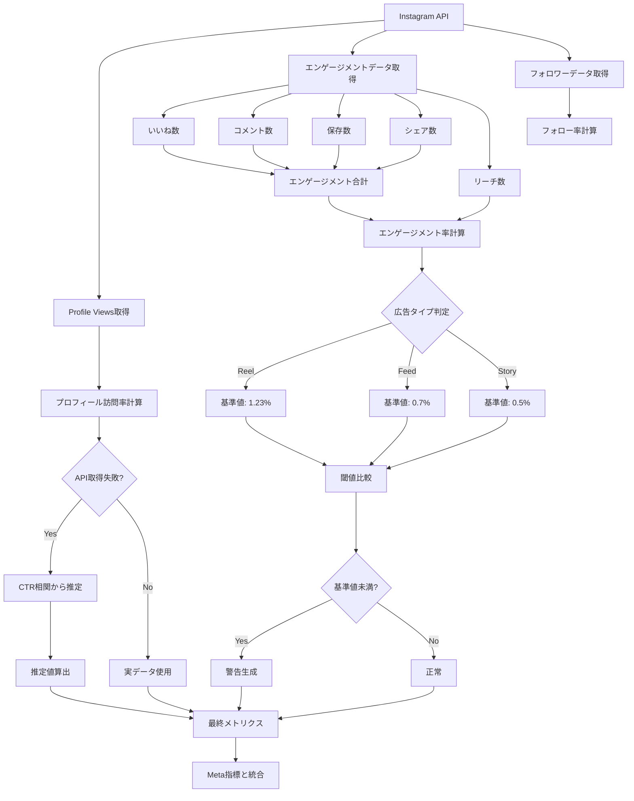

# データフロー図 - 広告疲労度スコアリングシステム

## システム全体データフロー

## 疲労度計算処理フロー

## データ検証・品質管理フロー

## 疲労度計算アルゴリズムフロー

## Instagram特有メトリクス処理フロー

## ベースライン計算・管理フロー

## エラーハンドリング・フォールバックフロー  

## リアルタイム更新・通知フロー

## パフォーマンス最適化フロー

