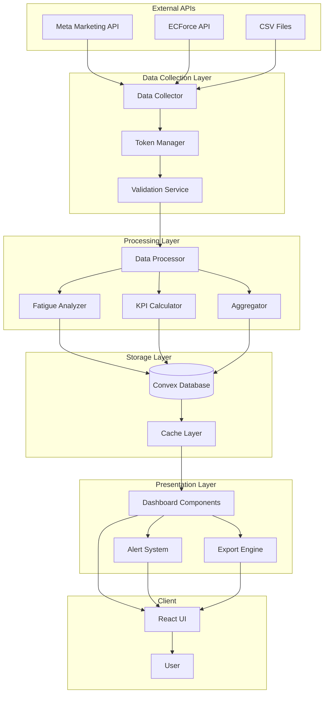
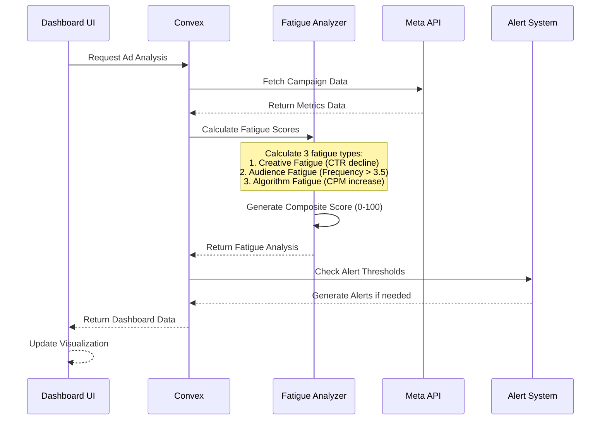
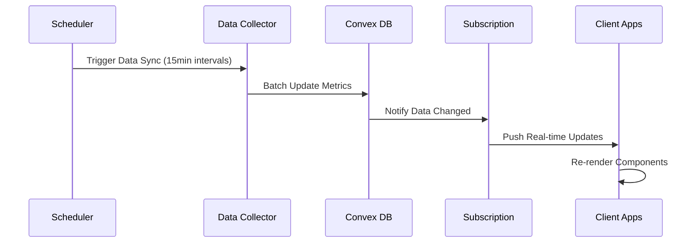
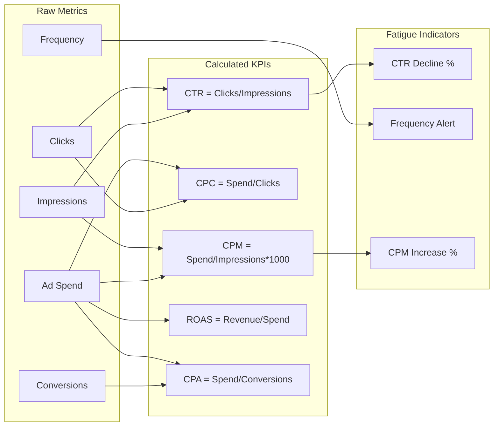
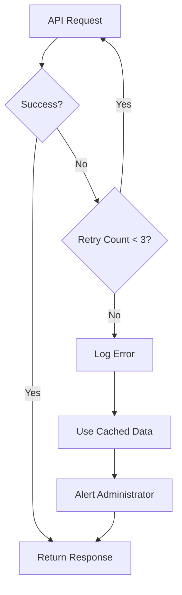

# データフロー図

## システム全体のデータフロー

```mermaid
flowchart TD
    subgraph "External APIs"
        META[Meta Marketing API]
        ECF[ECForce API]
        CSV[CSV Files]
    end
    
    subgraph "Data Collection Layer"
        DC[Data Collector]
        TM[Token Manager]
        VS[Validation Service]
    end
    
    subgraph "Processing Layer"
        DP[Data Processor]
        FA[Fatigue Analyzer]
        KPI[KPI Calculator]
        AG[Aggregator]
    end
    
    subgraph "Storage Layer"
        CVX[(Convex Database)]
        CACHE[Cache Layer]
    end
    
    subgraph "Presentation Layer"
        DASH[Dashboard Components]
        ALERT[Alert System]
        EXPORT[Export Engine]
    end
    
    subgraph "Client"
        UI[React UI]
        USER[User]
    end
    
    META --> DC
    ECF --> DC
    CSV --> DC
    
    DC --> TM
    TM --> VS
    VS --> DP
    
    DP --> FA
    DP --> KPI
    DP --> AG
    
    FA --> CVX
    KPI --> CVX
    AG --> CVX
    
    CVX --> CACHE
    CACHE --> DASH
    DASH --> ALERT
    DASH --> EXPORT
    
    DASH --> UI
    ALERT --> UI
    EXPORT --> UI
    UI --> USER
```

## 広告疲労度分析フロー

```mermaid
sequenceDiagram
    participant UI as Dashboard UI
    participant CVX as Convex
    participant FA as Fatigue Analyzer
    participant META as Meta API
    participant ALERT as Alert System
    
    UI->>CVX: Request Ad Analysis
    CVX->>META: Fetch Campaign Data
    META-->>CVX: Return Metrics Data
    
    CVX->>FA: Calculate Fatigue Scores
    Note over FA: Calculate 3 fatigue types:<br/>1. Creative Fatigue (CTR decline)<br/>2. Audience Fatigue (Frequency > 3.5)<br/>3. Algorithm Fatigue (CPM increase)
    
    FA->>FA: Generate Composite Score (0-100)
    FA-->>CVX: Return Fatigue Analysis
    
    CVX->>ALERT: Check Alert Thresholds
    ALERT-->>CVX: Generate Alerts if needed
    
    CVX-->>UI: Return Dashboard Data
    UI-->>UI: Update Visualization
```

## リアルタイムデータ同期フロー

```mermaid
sequenceDiagram
    participant SCHED as Scheduler
    participant COLLECT as Data Collector
    participant CVX as Convex DB
    participant SUB as Subscription
    participant CLIENT as Client Apps
    
    SCHED->>COLLECT: Trigger Data Sync (15min intervals)
    COLLECT->>CVX: Batch Update Metrics
    CVX->>SUB: Notify Data Changed
    SUB->>CLIENT: Push Real-time Updates
    CLIENT->>CLIENT: Re-render Components
```

## KPI計算フロー

```mermaid
flowchart LR
    subgraph "Raw Metrics"
        IMP[Impressions]
        CLICK[Clicks]
        CONV[Conversions]
        SPEND[Ad Spend]
        FREQ[Frequency]
    end
    
    subgraph "Calculated KPIs"
        CTR[CTR = Clicks/Impressions]
        CPC[CPC = Spend/Clicks]
        CPM[CPM = Spend/Impressions*1000]
        ROAS[ROAS = Revenue/Spend]
        CPA[CPA = Spend/Conversions]
    end
    
    subgraph "Fatigue Indicators"
        CTR_DECLINE[CTR Decline %]
        FREQ_ALERT[Frequency Alert]
        CPM_INCREASE[CPM Increase %]
    end
    
    IMP --> CTR
    CLICK --> CTR
    CLICK --> CPC
    SPEND --> CPC
    SPEND --> CPM
    IMP --> CPM
    CONV --> CPA
    SPEND --> CPA
    SPEND --> ROAS
    
    CTR --> CTR_DECLINE
    FREQ --> FREQ_ALERT
    CPM --> CPM_INCREASE
```

## エラーハンドリングフロー

```mermaid
flowchart TD
    START[API Request]
    SUCCESS{Success?}
    RETRY{Retry Count < 3?}
    LOG[Log Error]
    FALLBACK[Use Cached Data]
    ALERT_ADMIN[Alert Administrator]
    END[Return Response]
    
    START --> SUCCESS
    SUCCESS -->|Yes| END
    SUCCESS -->|No| RETRY
    RETRY -->|Yes| START
    RETRY -->|No| LOG
    LOG --> FALLBACK
    FALLBACK --> ALERT_ADMIN
    ALERT_ADMIN --> END
```