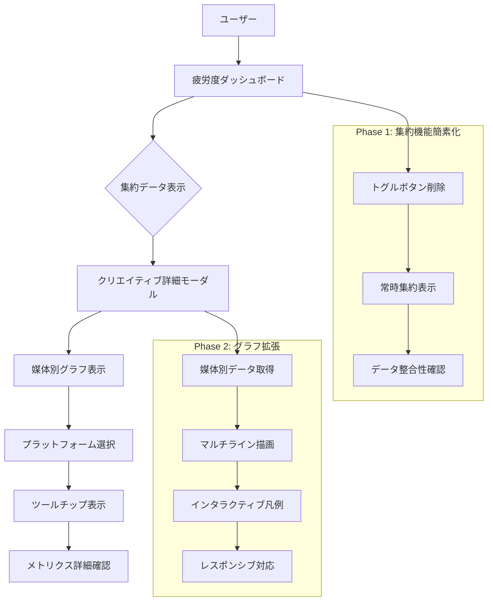
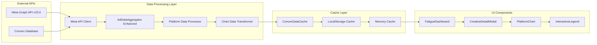
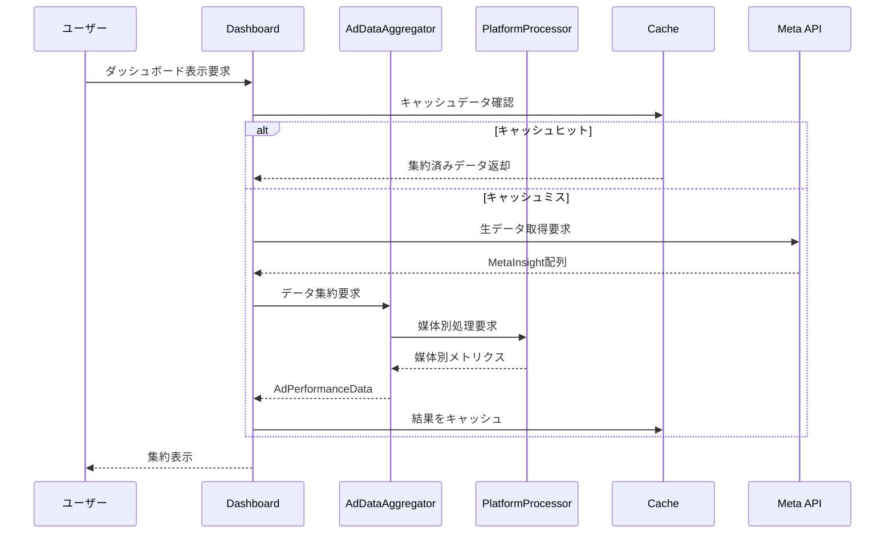
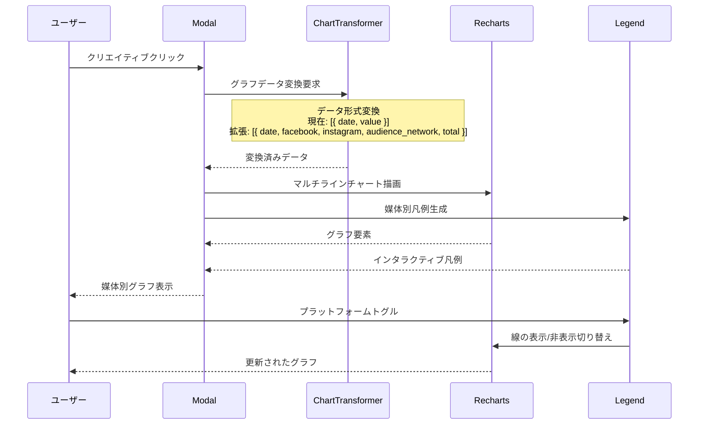
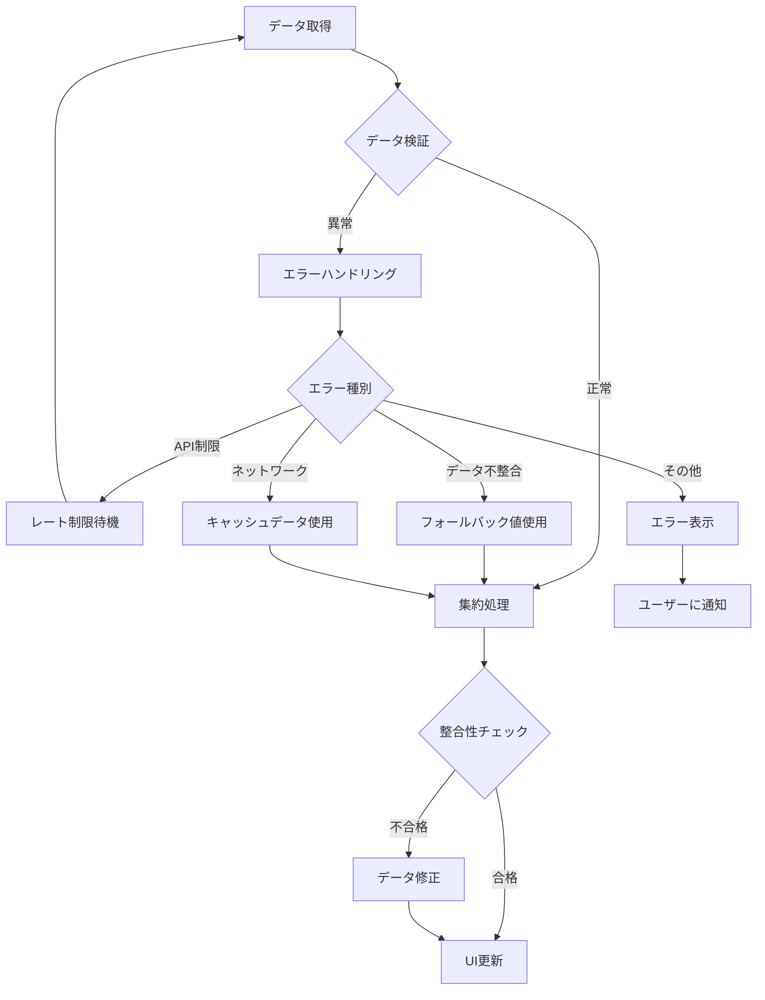
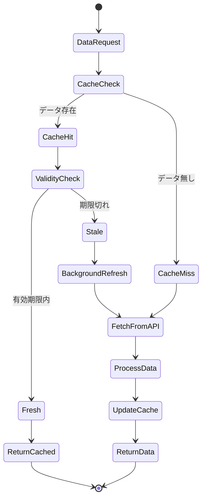
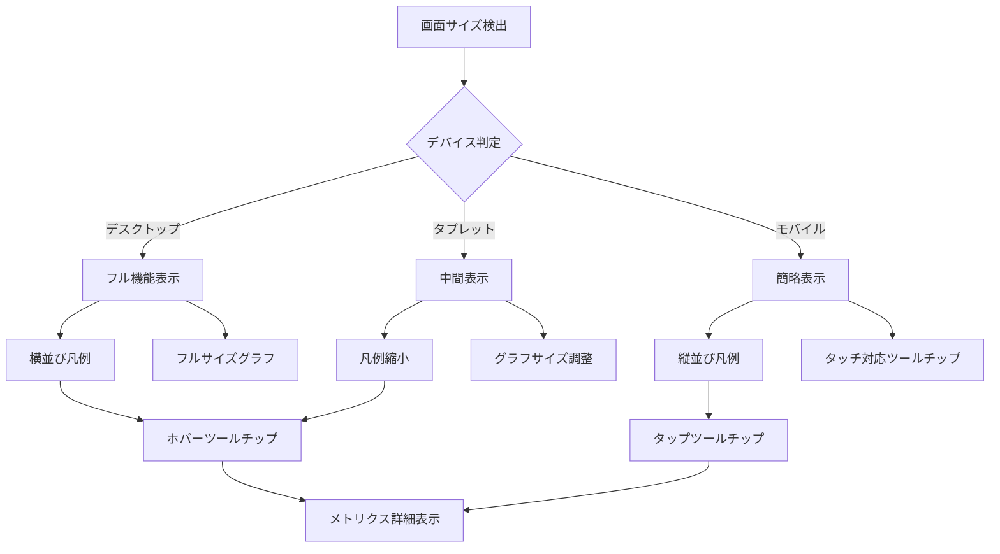
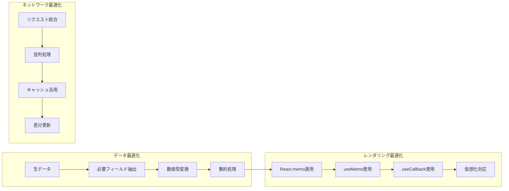
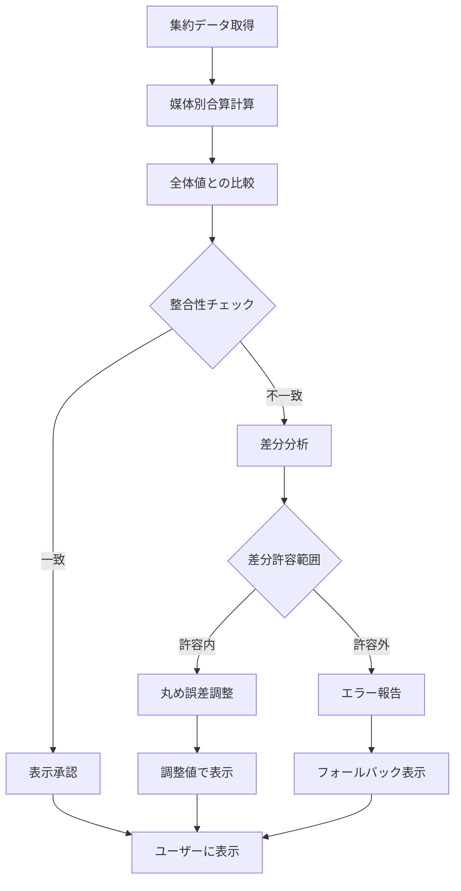
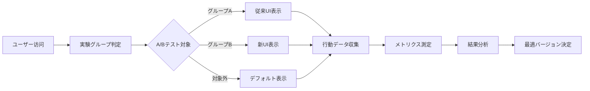

# データフロー図

## ユーザーインタラクションフロー

```mermaid
flowchart TD
    A[ユーザー] --> B[疲労度ダッシュボード]
    B --> C{集約データ表示}
    C --> D[クリエイティブ詳細モーダル]
    D --> E[媒体別グラフ表示]
    E --> F[プラットフォーム選択]
    F --> G[ツールチップ表示]
    G --> H[メトリクス詳細確認]
    
    subgraph "Phase 1: 集約機能簡素化"
        I[トグルボタン削除] --> J[常時集約表示]
        J --> K[データ整合性確認]
    end
    
    subgraph "Phase 2: グラフ拡張"
        L[媒体別データ取得] --> M[マルチライン描画]
        M --> N[インタラクティブ凡例]
        N --> O[レスポンシブ対応]
    end
    
    B --> I
    D --> L
```

## システムデータフロー

```mermaid
flowchart LR
    subgraph "External APIs"
        A[Meta Graph API v23.0]
        B[Convex Database]
    end
    
    subgraph "Data Processing Layer"
        C[Meta API Client]
        D[AdDataAggregator Enhanced]
        E[Platform Data Processor]
        F[Chart Data Transformer]
    end
    
    subgraph "Cache Layer"
        G[ConvexDataCache]
        H[LocalStorage Cache]
        I[Memory Cache]
    end
    
    subgraph "UI Components"
        J[FatigueDashboard]
        K[CreativeDetailModal]
        L[PlatformChart]
        M[InteractiveLegend]
    end
    
    A --> C
    B --> C
    C --> D
    D --> E
    E --> F
    F --> G
    G --> H
    H --> I
    I --> J
    J --> K
    K --> L
    L --> M
```

## データ集約処理フロー

```mermaid
sequenceDiagram
    participant U as ユーザー
    participant D as Dashboard
    participant A as AdDataAggregator
    participant P as PlatformProcessor
    participant C as Cache
    participant API as Meta API
    
    U->>D: ダッシュボード表示要求
    D->>C: キャッシュデータ確認
    alt キャッシュヒット
        C-->>D: 集約済みデータ返却
    else キャッシュミス
        D->>API: 生データ取得要求
        API-->>D: MetaInsight配列
        D->>A: データ集約要求
        A->>P: 媒体別処理要求
        P-->>A: 媒体別メトリクス
        A-->>D: AdPerformanceData
        D->>C: 結果をキャッシュ
    end
    D-->>U: 集約表示
```

## 媒体別グラフ表示フロー

```mermaid
sequenceDiagram
    participant U as ユーザー
    participant M as Modal
    participant T as ChartTransformer
    participant R as Recharts
    participant L as Legend
    
    U->>M: クリエイティブクリック
    M->>T: グラフデータ変換要求
    note over T: データ形式変換<br/>現在: [{ date, value }]<br/>拡張: [{ date, facebook, instagram, audience_network, total }]
    T-->>M: 変換済みデータ
    M->>R: マルチラインチャート描画
    M->>L: 媒体別凡例生成
    R-->>M: グラフ要素
    L-->>M: インタラクティブ凡例
    M-->>U: 媒体別グラフ表示
    
    U->>L: プラットフォームトグル
    L->>R: 線の表示/非表示切り替え
    R-->>U: 更新されたグラフ
```

## エラーハンドリングフロー

```mermaid
flowchart TD
    A[データ取得] --> B{データ検証}
    B -->|正常| C[集約処理]
    B -->|異常| D[エラーハンドリング]
    
    D --> E{エラー種別}
    E -->|API制限| F[レート制限待機]
    E -->|データ不整合| G[フォールバック値使用]
    E -->|ネットワーク| H[キャッシュデータ使用]
    E -->|その他| I[エラー表示]
    
    F --> A
    G --> C
    H --> C
    I --> J[ユーザーに通知]
    
    C --> K{整合性チェック}
    K -->|合格| L[UI更新]
    K -->|不合格| M[データ修正]
    M --> L
```

## キャッシュ管理フロー

```mermaid
stateDiagram-v2
    [*] --> DataRequest
    DataRequest --> CacheCheck
    
    CacheCheck --> CacheHit : データ存在
    CacheCheck --> CacheMiss : データ無し
    
    CacheHit --> ValidityCheck
    ValidityCheck --> Fresh : 有効期限内
    ValidityCheck --> Stale : 期限切れ
    
    Fresh --> ReturnCached
    Stale --> BackgroundRefresh
    CacheMiss --> FetchFromAPI
    
    BackgroundRefresh --> FetchFromAPI
    FetchFromAPI --> ProcessData
    ProcessData --> UpdateCache
    UpdateCache --> ReturnData
    
    ReturnCached --> [*]
    ReturnData --> [*]
```

## レスポンシブ対応フロー

```mermaid
flowchart TD
    A[画面サイズ検出] --> B{デバイス判定}
    B -->|デスクトップ| C[フル機能表示]
    B -->|タブレット| D[中間表示]
    B -->|モバイル| E[簡略表示]
    
    C --> F[横並び凡例]
    C --> G[フルサイズグラフ]
    
    D --> H[凡例縮小]
    D --> I[グラフサイズ調整]
    
    E --> J[縦並び凡例]
    E --> K[タッチ対応ツールチップ]
    
    F --> L[ホバーツールチップ]
    H --> L
    J --> M[タップツールチップ]
    
    L --> N[メトリクス詳細表示]
    M --> N
```

## パフォーマンス最適化フロー

```mermaid
flowchart LR
    subgraph "データ最適化"
        A[生データ] --> B[必要フィールド抽出]
        B --> C[数値型変換]
        C --> D[集約処理]
    end
    
    subgraph "レンダリング最適化"
        E[React.memo適用]
        F[useMemo使用]
        G[useCallback使用]
        H[仮想化対応]
    end
    
    subgraph "ネットワーク最適化"
        I[リクエスト統合]
        J[並列処理]
        K[キャッシュ活用]
        L[差分更新]
    end
    
    D --> E
    E --> F
    F --> G
    G --> H
    
    I --> J
    J --> K
    K --> L
```

## データ整合性検証フロー

```mermaid
flowchart TD
    A[集約データ取得] --> B[媒体別合算計算]
    B --> C[全体値との比較]
    C --> D{整合性チェック}
    
    D -->|一致| E[表示承認]
    D -->|不一致| F[差分分析]
    
    F --> G{差分許容範囲}
    G -->|許容内| H[丸め誤差調整]
    G -->|許容外| I[エラー報告]
    
    H --> J[調整値で表示]
    I --> K[フォールバック表示]
    
    E --> L[ユーザーに表示]
    J --> L
    K --> L
```

## A/Bテスト実装フロー

```mermaid
flowchart LR
    A[ユーザー访问] --> B[実験グループ判定]
    B --> C{A/Bテスト対象}
    
    C -->|グループA| D[従来UI表示]
    C -->|グループB| E[新UI表示]
    C -->|対象外| F[デフォルト表示]
    
    D --> G[行動データ収集]
    E --> G
    F --> G
    
    G --> H[メトリクス測定]
    H --> I[結果分析]
    I --> J[最適バージョン決定]
```