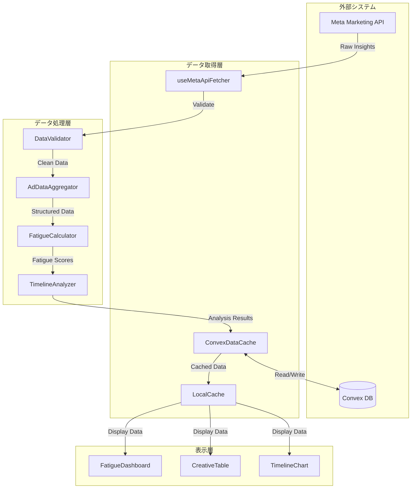
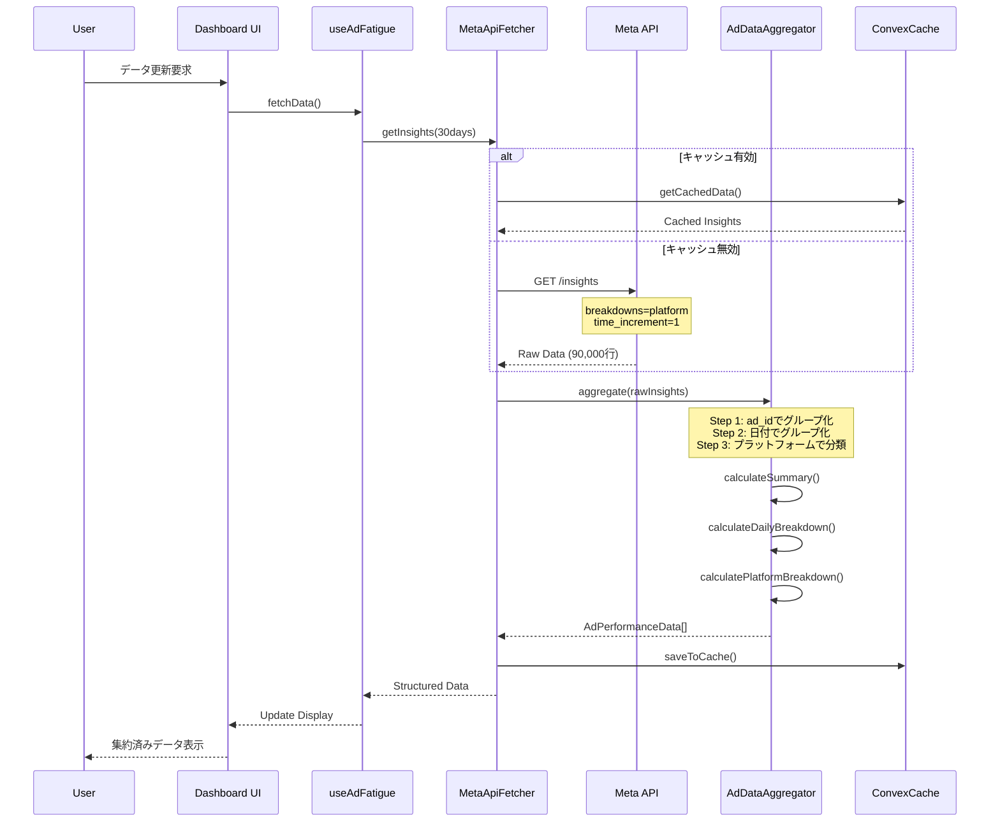
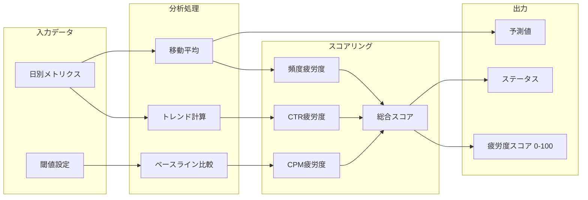
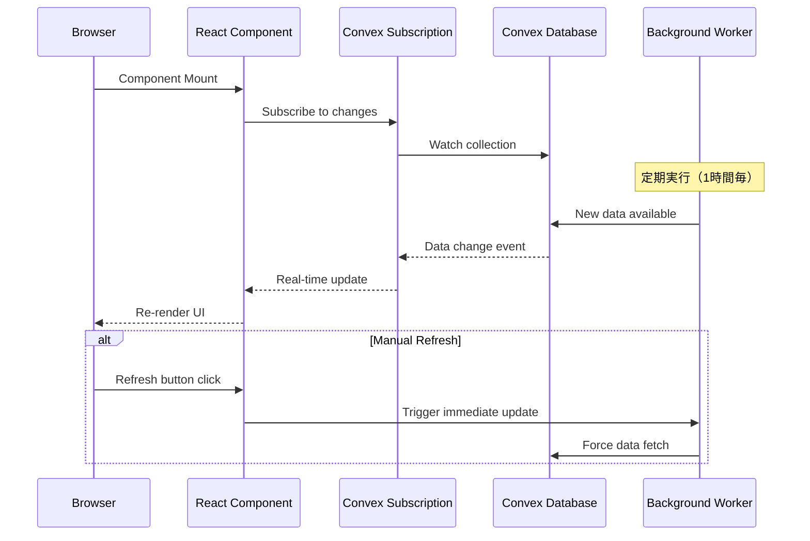
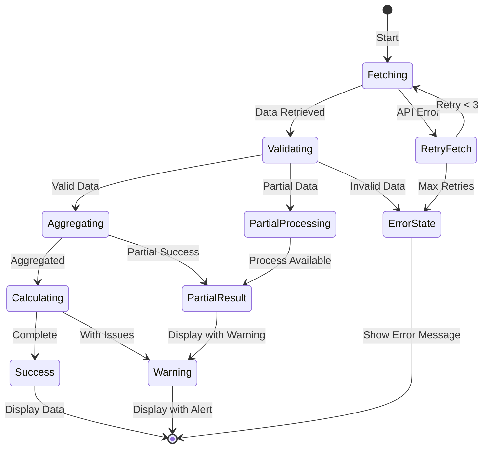
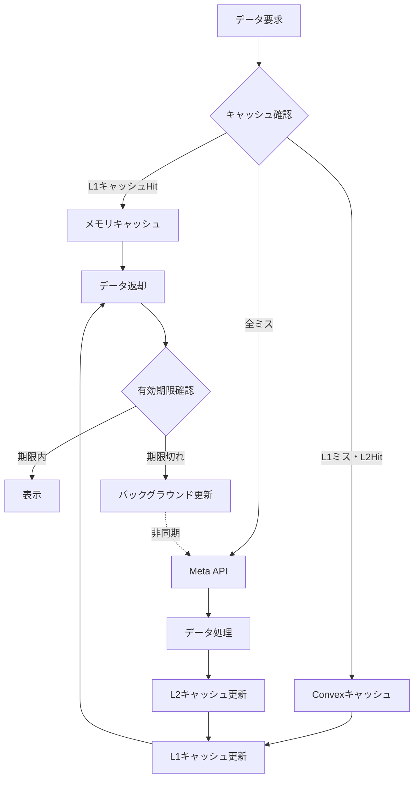
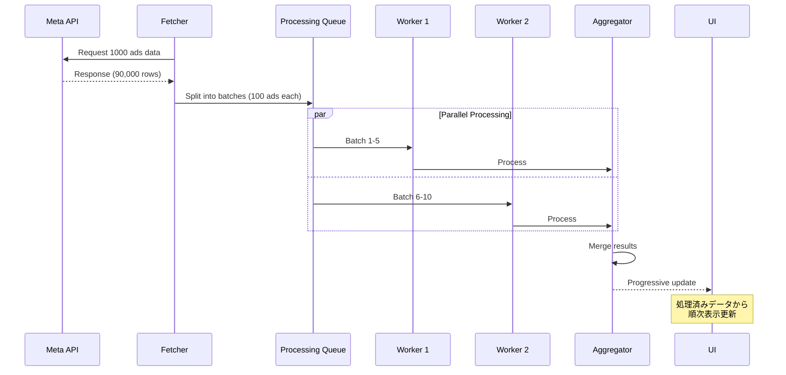

# データフロー図

## 1. 全体データフロー



## 2. データ集約プロセス



## 3. 疲労度計算フロー



## 4. リアルタイム更新フロー



## 5. エラーハンドリングフロー



## 6. キャッシュ戦略フロー



## 7. 期間フィルタリングフロー

```mermaid
flowchart LR
    subgraph Storage["データストレージ"]
        FULL[30日分データ<br/>AdPerformanceData[]]
    end
    
    subgraph Filter["フィルタリング"]
        RANGE[期間選択<br/>7d/14d/30d]
        FILTER_FN[filterByDateRange()]
    end
    
    subgraph Display["表示処理"]
        SUMMARY[サマリー再計算]
        DAILY[日別データ抽出]
        RENDER[UI更新]
    end
    
    FULL --> RANGE
    RANGE --> FILTER_FN
    FILTER_FN --> SUMMARY
    FILTER_FN --> DAILY
    SUMMARY --> RENDER
    DAILY --> RENDER
```

## 8. バッチ処理フロー（大量データ対応）



## 9. データ変換パイプライン

```mermaid
flowchart TB
    subgraph Raw["生データ (AdInsight[])"]
        R1[ad_id: "123"<br/>date: "2025-01-01"<br/>platform: "facebook"<br/>impressions: 1000]
        R2[ad_id: "123"<br/>date: "2025-01-01"<br/>platform: "instagram"<br/>impressions: 500]
        R3[ad_id: "123"<br/>date: "2025-01-02"<br/>platform: "facebook"<br/>impressions: 1200]
    end
    
    subgraph Transform["変換処理"]
        GROUP[Group by ad_id]
        PIVOT[Pivot by date/platform]
        CALC[Calculate aggregates]
    end
    
    subgraph Structured["構造化データ (AdPerformanceData)"]
        S1[ad_id: "123"<br/>summary: {total: 2700}<br/>dailyBreakdown: [...]<br/>platformBreakdown: {...}]
    end
    
    Raw --> GROUP
    GROUP --> PIVOT
    PIVOT --> CALC
    CALC --> Structured
```

---

作成日: 2025-08-27
バージョン: 1.0.0