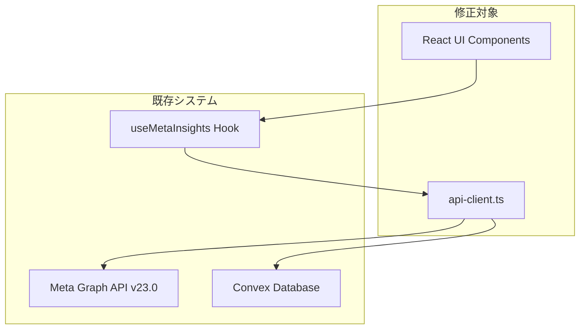

# Meta API 正しいデータ取得システム - アーキテクチャ設計

## システム概要

Meta APIから30日分の広告データを要求する際に発生している「1-6日分しか取得できない」問題を解決するため、完全なページネーション実装によりデータ取得の確実性を向上させる。

**設計方針**: 複雑性を排除し、既存のReact + TypeScript + Convex スタック内でのシンプルな改修に集中する。

## アーキテクチャパターン

- **パターン**: レイヤードアーキテクチャ + 既存スタック活用
- **理由**: 
  - 既存のコードベースを最大活用
  - 破壊的変更を最小限に抑制
  - シンプルな修正による確実な効果

## コンポーネント構成

### フロントエンド (既存)
- **フレームワーク**: React 19 + TypeScript + Vite
- **状態管理**: React Hooks (useState, useEffect)
- **スタイリング**: Tailwind CSS
- **修正対象**: UIコンポーネントでの実配信日数表示

### データアクセス層 (修正対象)
- **コア**: `src/features/meta-api/core/api-client.ts`
- **役割**: Meta Graph API v23.0 との通信
- **主要修正**: ページネーション完全実装

### バックエンド (既存)
- **フレームワーク**: Convex
- **データベース**: Convex 内蔵DB
- **認証**: 既存の認証システム活用

## アーキテクチャ図

## 修正戦略

### Phase 1: api-client.ts 修正
1. `fetchPaginatedData` メソッドの完全ページネーション実装
2. `while (response.paging?.next)` ループによる全ページ取得
3. エラーハンドリング強化とリトライ処理

### Phase 2: UI表示改善
1. 実配信日数の表示追加
2. 「X日/30日配信」ラベル表示
3. 取得状況のログ表示

## 非機能要件への対応

### パフォーマンス対応
- **目標**: 30秒以内での全データ取得完了
- **手段**: 
  - レート制限遵守 (200コール/時間)
  - 効率的なページング実装
  - 不要なAPI呼び出し削減

### 信頼性対応
- **エラーハンドリング**: 3回リトライメカニズム
- **データ保護**: 部分データの保持機能
- **ログ出力**: デバッグ可能な詳細ログ

## 技術スタック詳細

### 既存技術 (変更なし)
- React 19
- TypeScript
- Vite
- Tailwind CSS
- Convex

### 新規依存関係 (なし)
複雑性排除のため、新規ライブラリは導入しない。

## セキュリティ考慮

### API認証
- 既存のMeta APIトークン管理を継続使用
- トークン無効化時の適切なエラーハンドリング

### レート制限
- Meta API制限 (200コール/時間) の厳密な遵守
- 制限到達時の適切な待機処理

## 拡張性考慮

### 将来的な機能追加への備え
- モジュラー設計による機能追加の容易性
- インターフェースの安定性確保
- ログ出力による分析データの蓄積

## 除外した複雑機能

以下の機能は意図的に除外し、シンプルさを優先：

- ❌ 学習アルゴリズム
- ❌ 動的最適化システム
- ❌ 複雑なキャッシュ戦略
- ❌ タイムラインビュー
- ❌ 予測機能
- ❌ A/Bテスト分析
- ❌ マルチティアキャッシュ

## まとめ

本設計は「正しいデータ取得」という単一目標に集中し、既存システムへの最小限の修正で最大限の効果を得ることを目指している。複雑性を排除することで、実装の確実性と保守性を確保する。