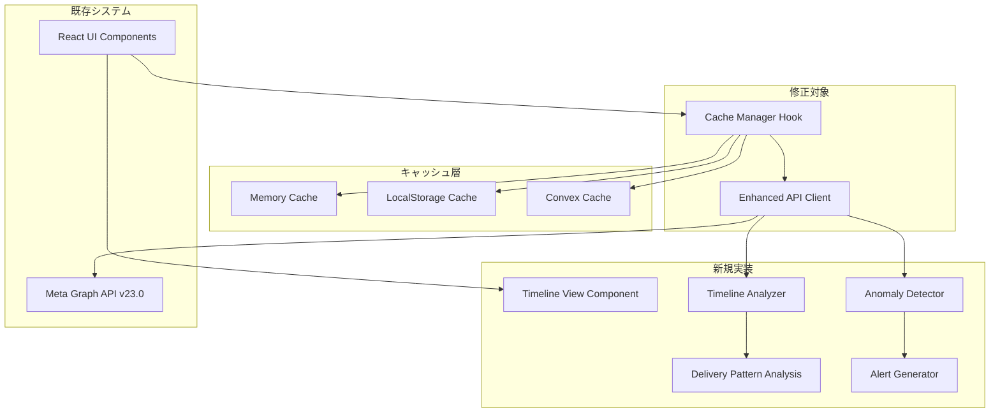

# Meta API 正しいデータ取得システム - 運用対応アーキテクチャ設計

## システム概要

Meta APIから30日分の広告データを要求する際に発生している「1-6日分しか取得できない」問題を解決し、運用に必須な**タイムライン表示**と**効率的なキャッシュ戦略**により実用的な広告運用システムを構築する。

**設計方針**: 
- ページネーション完全実装による確実なデータ取得
- **配信履歴の可視化**による運用品質向上  
- **3層キャッシュ戦略**によるコスト削減とパフォーマンス向上
- 既存React + TypeScript + Convexスタックとの統合

## アーキテクチャパターン

- **パターン**: レイヤードアーキテクチャ + 既存スタック活用
- **理由**: 
  - 既存のコードベースを最大活用
  - 破壊的変更を最小限に抑制
  - シンプルな修正による確実な効果

## コンポーネント構成

### フロントエンド層
- **フレームワーク**: React 19 + TypeScript + Vite
- **状態管理**: React Hooks + 3層キャッシュ
- **スタイリング**: Tailwind CSS
- **新機能**: 
  - タイムラインビューコンポーネント
  - 配信状況カレンダー
  - 異常検知アラート表示

### キャッシュ層 (新規実装)
- **Memory Cache**: セッション内高速アクセス (TTL: 5分)
- **LocalStorage Cache**: ブラウザ永続化 (TTL: 1-24時間)  
- **Convex Cache**: DB永続化 (TTL: 差分更新対応)

### データアクセス層 (大幅修正)
- **コア**: `src/features/meta-api/core/api-client.ts`
- **拡張**: `src/features/meta-api/core/timeline-analyzer.ts`
- **新機能**:
  - 完全ページネーション実装
  - 差分更新メカニズム
  - 異常パターン検知

### バックエンド層 (Convex拡張)
- **既存**: Convex基盤
- **追加**: キャッシュテーブル、タイムラインデータ構造
- **認証**: 既存システム活用

## アーキテクチャ図

## 実装戦略 (4フェーズ)

### Phase 1: 基盤整備 (必須)
1. `fetchPaginatedData` メソッドの完全ページネーション実装
2. `while (response.paging?.next)` ループによる全ページ取得
3. エラーハンドリング強化とリトライ処理
4. 基本的なログ出力

### Phase 2: キャッシュ層実装 (必須)
1. **3層キャッシュアーキテクチャ**構築
   - Memory Cache: React state ベース
   - LocalStorage Cache: ブラウザ永続化
   - Convex Cache: DB永続化
2. **TTL管理機能**
   - リアルタイムデータ: 5分
   - 直近7日: 1時間  
   - 履歴データ: 24時間
3. **差分取得メカニズム**
   - 前回取得以降の新規データのみ取得
   - 既存データとのマージ処理

### Phase 3: タイムライン機能 (必須)
1. **TimelineAnalyzer**実装
   - 30日間の配信状況を日別分析
   - 配信ギャップの自動検出
   - 配信強度の時系列変化追跡
2. **AnomalyDetector**実装
   - 突然の配信停止検知
   - 異常な配信パターン識別
3. **視覚化コンポーネント**
   - カレンダービューまたは時系列グラフ
   - 配信強度ヒートマップ
   - 異常期間のハイライト

### Phase 4: 運用機能 (推奨)
1. 監視・アラート機能
2. パフォーマンスメトリクス
3. 自動リトライ・回復機能

## 非機能要件への対応

### パフォーマンス対応
- **目標**: 30秒以内での全データ取得完了
- **手段**: 
  - レート制限遵守 (200コール/時間)
  - 効率的なページング実装
  - 不要なAPI呼び出し削減

### 信頼性対応
- **エラーハンドリング**: 3回リトライメカニズム
- **データ保護**: 部分データの保持機能
- **ログ出力**: デバッグ可能な詳細ログ

## 技術スタック詳細

### 既存技術 (変更なし)
- React 19
- TypeScript
- Vite
- Tailwind CSS
- Convex

### 新規依存関係 (なし)
複雑性排除のため、新規ライブラリは導入しない。

## セキュリティ考慮

### API認証
- 既存のMeta APIトークン管理を継続使用
- トークン無効化時の適切なエラーハンドリング

### レート制限
- Meta API制限 (200コール/時間) の厳密な遵守
- 制限到達時の適切な待機処理

## 拡張性考慮

### 将来的な機能追加への備え
- モジュラー設計による機能追加の容易性
- インターフェースの安定性確保
- ログ出力による分析データの蓄積

## 必須機能 vs 除外機能

### ✅ 必須機能 (実装対象)
- **完全ページネーション** - データ取得の確実性
- **3層キャッシュ戦略** - コスト削減・パフォーマンス向上
- **タイムラインビュー** - 運用品質・異常検知
- **差分更新機能** - 効率的データ取得
- **配信パターン分析** - 実態把握

### ❌ 除外機能 (複雑性排除)
- 機械学習による予測機能
- A/Bテスト分析
- 複雑な統計分析機能
- 動的パラメータ最適化
- マルチアカウント学習機能

### 🔄 再評価した機能
- **タイムラインビュー**: 除外 → **必須** (運用上不可欠)
- **キャッシュ戦略**: 除外 → **必須** (コスト・パフォーマンス)
- **異常検知**: 除外 → **必須** (死活監視)

## パフォーマンス目標

### 初回読み込み
- **目標**: 2秒以内
- **手段**: 差分更新による最小データ取得

### キャッシュヒット時
- **目標**: 100ms以内  
- **手段**: メモリキャッシュ活用

### タイムライン描画
- **目標**: 500ms以内
- **手段**: 仮想化・遅延読み込み

### キャッシュヒット率
- **目標**: 80%以上
- **手段**: 適切なTTL設定

## まとめ

本設計は「正しいデータ取得」を基盤として、**運用に不可欠なタイムライン表示とキャッシュ戦略**を統合した実用的なシステムを構築する。

**設計の特徴**:
- ✅ 確実なデータ取得 (ページネーション完全実装)
- ✅ 運用品質向上 (タイムライン・異常検知)
- ✅ コスト効率 (3層キャッシュによるAPI削減)
- ✅ 実装可能性 (既存スタック活用)

この設計により、広告運用の実用性と技術的信頼性を両立する。