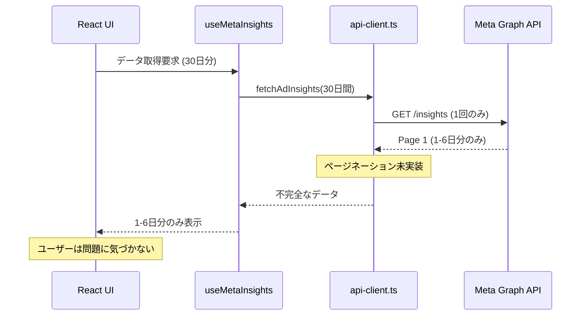
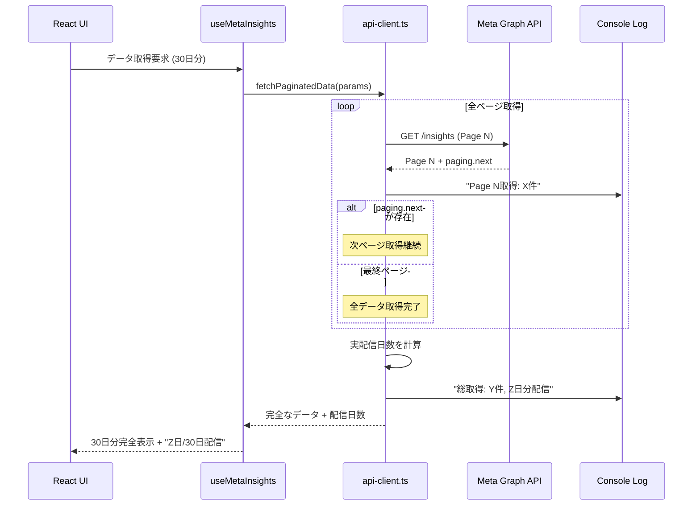
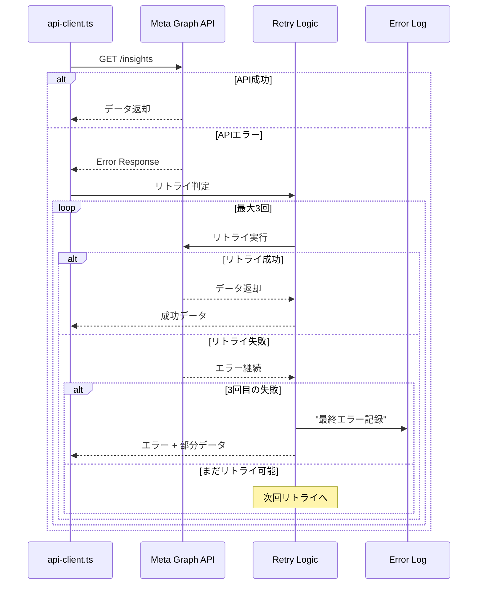
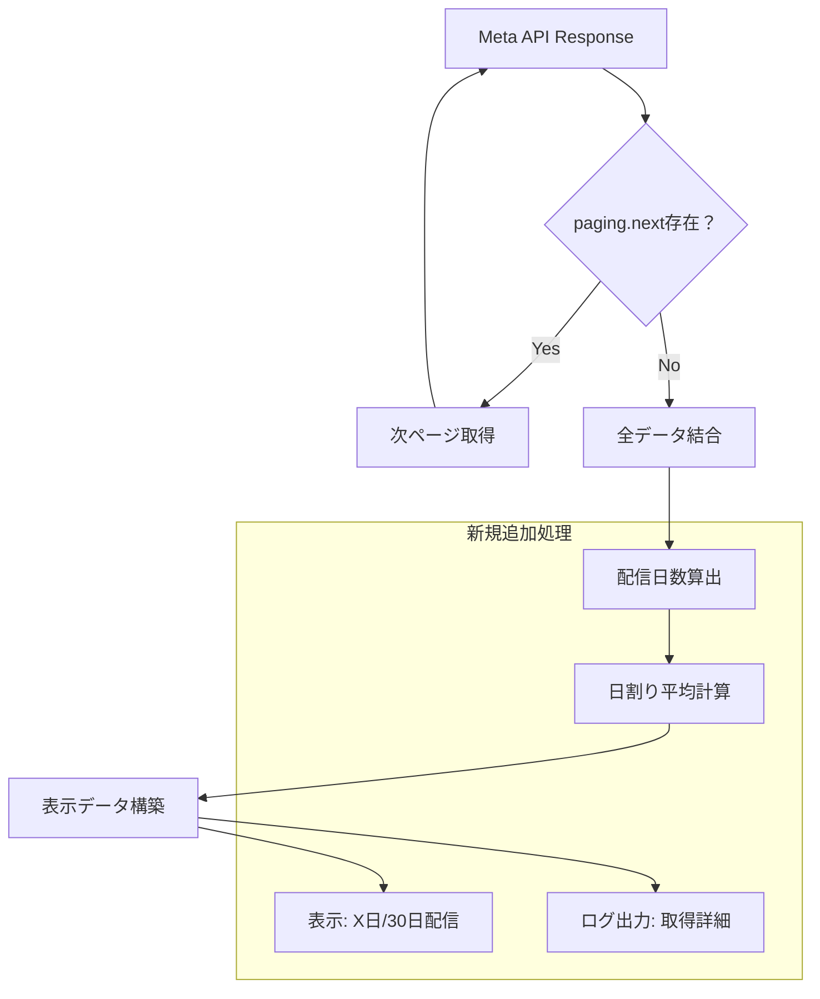
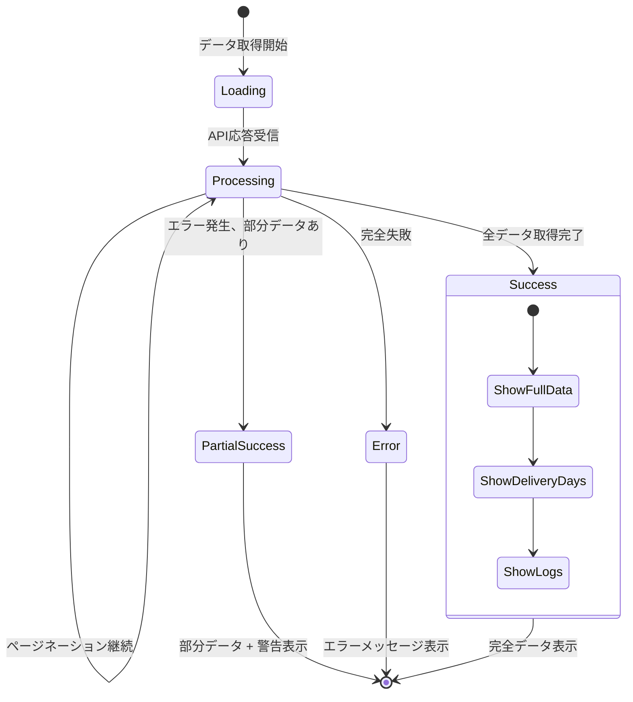
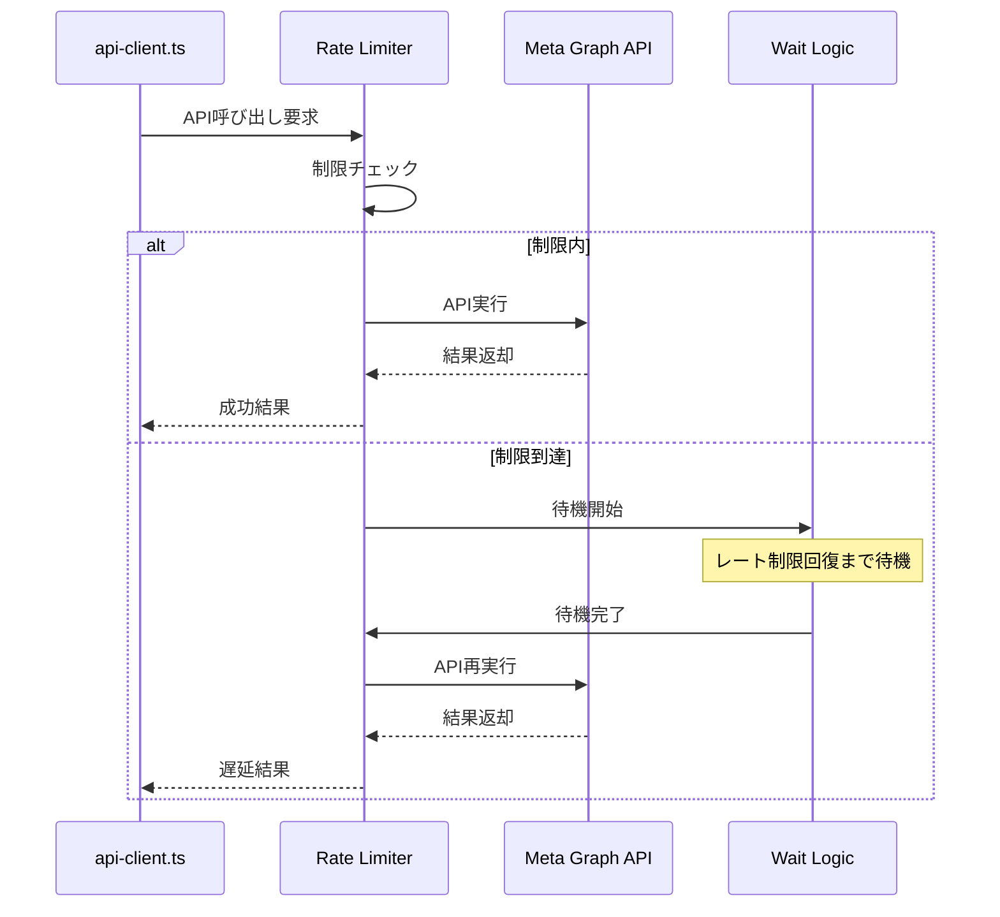
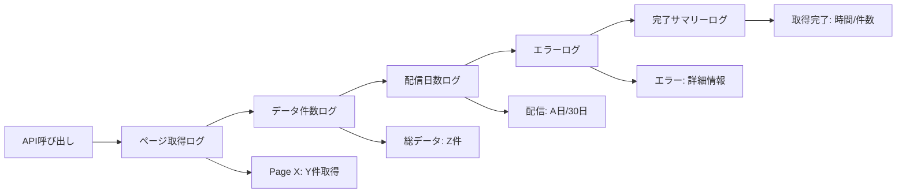

# Meta API データ取得フロー設計

## 現在の問題のあるフロー

## 修正後の完全データ取得フロー

## エラーハンドリングフロー

## データ処理フロー

## UI更新フロー

## レート制限対応フロー

## ログ出力フロー

## データフロー要点

### 修正前の問題点
1. **単一ページ取得のみ** → 1-6日分のデータ不足
2. **エラーハンドリング不備** → 失敗時の対処不能
3. **取得状況不明** → デバッグ困難

### 修正後の改善点
1. **完全ページネーション** → 30日分確実取得
2. **3回リトライ機構** → 一時的エラーに対応
3. **詳細ログ出力** → 透明性と診断性向上
4. **配信日数表示** → ユーザーの理解促進

この設計により、「正しいデータ取得」という要件を確実に満たしながら、実装の複雑性は最小限に抑制する。