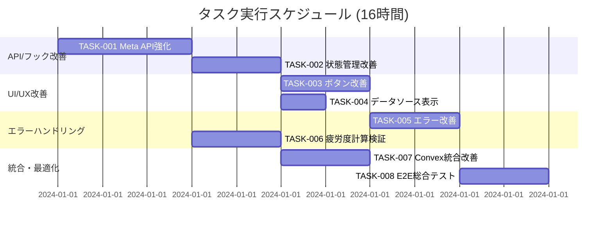

# 広告疲労度データ更新機能 実装タスク

## 概要

全タスク数: 8
推定作業時間: 16時間
クリティカルパス: TASK-001 → TASK-002 → TASK-003 → TASK-004

## タスク一覧

### フェーズ1: API・フック改善

#### TASK-001: Meta API フェッチャーの信頼性向上

- [x] **タスク完了**
- **タスクタイプ**: TDD
- **要件リンク**: REQ-402, REQ-403, NFR-001, EDGE-001, EDGE-002
- **依存タスク**: なし
- **実装詳細**:
  - `useMetaApiFetcher` フックのエラーハンドリング強化
  - 同時実行制限の実装 (最大1リクエスト)
  - タイムアウト設定 (30秒)
  - トークン有効期限チェック機能追加
  - レスポンスデータ検証の実装
- **テスト要件**:
  - [ ] 単体テスト: 同時実行制限が正しく動作すること
  - [ ] 単体テスト: タイムアウトが30秒で発動すること
  - [ ] 単体テスト: 無効なトークンでエラーが返されること
  - [ ] 単体テスト: 不正レスポンスで検証エラーになること
  - [ ] 統合テスト: Meta API通信の信頼性テスト
- **エラーハンドリング**:
  - [ ] Meta APIメンテナンス時の適切なフォールバック
  - [ ] ネットワーク障害時の再試行ロジック
  - [ ] レート制限超過時の待機処理
- **完了条件**:
  - [ ] フェッチャーが安定して動作している
  - [ ] エラーケースが適切にハンドリングされている
  - [ ] すべてのテストがパスしている

#### TASK-002: データ更新状態管理の改善

- [ ] **タスク完了**
- **タスクタイプ**: TDD
- **要件リンク**: REQ-101, REQ-201, REQ-203, NFR-002
- **依存タスク**: TASK-001
- **実装詳細**:
  - `useAdFatigue` フックの状態管理改善
  - 更新中の重複実行防止メカニズム
  - 進行状況の詳細追跡機能
  - 成功/失敗時のコールバック実装
  - UI応答性を保つ非同期処理最適化
- **テスト要件**:
  - [ ] 単体テスト: 更新中の重複実行が防止されること
  - [ ] 単体テスト: 状態変更が正しくトラッキングされること
  - [ ] 単体テスト: コールバックが適切に実行されること
  - [ ] パフォーマンステスト: UI応答性が100ms以下を維持すること
- **UI/UX要件**:
  - [ ] ローディング状態: スピナー + 進行テキスト表示
  - [ ] エラー表示: 詳細なエラーメッセージ + 対処法
  - [ ] 成功表示: 一時的な成功インジケーター (3秒表示)
- **完了条件**:
  - [ ] 状態管理が正しく動作している
  - [ ] UI応答性が要件を満たしている
  - [ ] エラー・成功ケースが適切に表示されている

### フェーズ2: UI/UX改善

#### TASK-003: 更新ボタンコンポーネントの改善

- [ ] **タスク完了**
- **タスクタイプ**: TDD
- **要件リンク**: REQ-001, REQ-101, REQ-105, NFR-201, NFR-202
- **依存タスク**: TASK-002
- **実装詳細**:
  - 更新ボタンの視覚的改善
  - 動的なボタン状態表示（通常/実行中/無効）
  - 進行状況インジケーターの統合
  - アクセシビリティ対応の実装
  - モバイルレスポンシブ対応
- **テスト要件**:
  - [ ] コンポーネントテスト: ボタン状態変化の確認
  - [ ] コンポーネントテスト: アクセシビリティ属性の確認
  - [ ] ビジュアルテスト: デザインガイドライン準拠確認
  - [ ] E2Eテスト: モバイル表示の確認
- **UI/UX要件**:
  - [ ] ローディング状態: ボタン内スピナー + 「更新中...」テキスト
  - [ ] エラー表示: ボタン色変更 + ツールチップエラー表示
  - [ ] モバイル対応: タッチ操作に最適化されたサイズ
  - [ ] アクセシビリティ: キーボード操作、スクリーンリーダー対応
- **完了条件**:
  - [ ] ボタンが直感的に使いやすい
  - [ ] すべての端末で正しく表示される
  - [ ] アクセシビリティ要件を満たしている

#### TASK-004: データソース表示の改善

- [ ] **タスク完了**
- **タスクタイプ**: TDD
- **要件リンク**: REQ-005, NFR-203
- **依存タスク**: TASK-002
- **実装詳細**:
  - データソースインジケーターのデザイン改善
  - キャッシュ/API表示の明確化
  - 最終更新時刻の表示追加
  - データ品質インジケーターの実装
  - 日本語ローカライゼーション完成
- **テスト要件**:
  - [ ] コンポーネントテスト: データソース表示の正確性
  - [ ] コンポーネントテスト: 時刻フォーマットの確認
  - [ ] 統合テスト: データ変更時の表示更新確認
- **UI/UX要件**:
  - [ ] 表示形式: アイコン + テキストでの分かりやすい表示
  - [ ] 情報階層: 主要情報の優先度に応じた視覚的重み付け
  - [ ] 一貫性: 他コンポーネントとのデザイン統一
- **完了条件**:
  - [ ] データソースが一目で分かる表示になっている
  - [ ] 最終更新時刻が正確に表示されている
  - [ ] 日本語表示が自然で分かりやすい

### フェーズ3: エラーハンドリング・レジリエンス強化

#### TASK-005: エラーメッセージ・アラート改善

- [ ] **タスク完了**
- **タスクタイプ**: TDD
- **要件リンク**: REQ-102, REQ-104, REQ-202, NFR-103, NFR-203, EDGE-002, EDGE-003
- **依存タスク**: TASK-001, TASK-003
- **実装詳細**:
  - Alertコンポーネントのエラー分類強化
  - 具体的なアクションボタンの実装
  - エラーレベル別の視覚的差別化
  - センシティブ情報の除外処理
  - 多言語対応エラーメッセージ辞書
- **テスト要件**:
  - [ ] 単体テスト: エラー分類ロジックの確認
  - [ ] 単体テスト: センシティブ情報の除外確認
  - [ ] 統合テスト: 各エラーケースでの適切なメッセージ表示
  - [ ] セキュリティテスト: トークン情報の非露出確認
- **エラーハンドリング**:
  - [ ] トークン期限切れ → Meta API設定画面へのリンク表示
  - [ ] ネットワークエラー → 再試行ボタン表示
  - [ ] 権限エラー → 権限確認手順の表示
  - [ ] レート制限 → 待機時間の表示
- **UI/UX要件**:
  - [ ] エラー表示: 色分け (情報/警告/エラー/致命的)
  - [ ] アクション提示: 明確で実行可能な次の手順
  - [ ] 言語対応: 日本語での自然で分かりやすい表現
- **完了条件**:
  - [ ] エラーが分かりやすく分類表示されている
  - [ ] 適切な対処法が提示されている
  - [ ] セキュリティが確保されている

#### TASK-006: 疲労度計算の検証・最適化

- [ ] **タスク完了**
- **タスクタイプ**: TDD
- **要件リンク**: REQ-003, REQ-117, REQ-132, EDGE-101, EDGE-102
- **依存タスク**: TASK-001
- **実装詳細**:
  - `SimpleFatigueCalculator` の検証ロジック強化
  - 大量データ (>1000件) の分割処理実装
  - 0件データ時の適切な処理
  - 計算結果の一貫性検証
  - パフォーマンス最適化
- **テスト要件**:
  - [ ] 単体テスト: 各疲労度指標の計算精度確認
  - [ ] 単体テスト: 0件データでの処理確認
  - [ ] パフォーマンステスト: 1000件データでの処理時間確認
  - [ ] 統合テスト: 実データでの計算結果妥当性確認
- **エラーハンドリング**:
  - [ ] データなし時の「データなし」メッセージ表示
  - [ ] 異常値検出時の警告表示
  - [ ] 計算エラー時の適切なフォールバック
- **完了条件**:
  - [ ] 疲労度計算が正確で高速である
  - [ ] 異常ケースが適切にハンドリングされている
  - [ ] パフォーマンス要件を満たしている

### フェーズ4: 統合・最適化

#### TASK-007: Convexキャッシュ統合の改善

- [ ] **タスク完了**
- **タスクタイプ**: TDD
- **要件リンク**: REQ-103, NFR-003, NFR-301, NFR-302
- **依存タスク**: TASK-001, TASK-002
- **実装詳細**:
  - `useConvexCache` フックのフォールバック機能強化
  - キャッシュ無効化タイミングの最適化
  - 部分データ取得失敗時の継続処理
  - キャッシュとAPIデータの一貫性確保
  - エラー発生時のキャッシュ保持戦略
- **テスト要件**:
  - [ ] 統合テスト: Convex連携の動作確認
  - [ ] 単体テスト: フォールバックロジックの確認
  - [ ] パフォーマンステスト: キャッシュ効果の測定
  - [ ] 障害テスト: API障害時のキャッシュ動作確認
- **エラーハンドリング**:
  - [ ] API障害時の自動キャッシュフォールバック
  - [ ] 部分失敗時の取得済みデータ表示継続
  - [ ] キャッシュ破損時の自動復旧
- **完了条件**:
  - [ ] API障害に強いシステムになっている
  - [ ] データの一貫性が保たれている
  - [ ] パフォーマンスが向上している

#### TASK-008: E2Eテスト・総合動作確認

- [ ] **タスク完了**
- **タスクタイプ**: TDD
- **要件リンク**: 全要件（受け入れ基準）
- **依存タスク**: TASK-003, TASK-004, TASK-005, TASK-006, TASK-007
- **実装詳細**:
  - データ更新フローのE2Eテストスイート作成
  - 各エラーケースの動作確認テスト
  - ユーザビリティテストの自動化
  - パフォーマンステストの統合
  - 受け入れ基準の全項目確認
- **テスト要件**:
  - [ ] E2Eテスト: 正常な更新フローの確認
  - [ ] E2Eテスト: エラーケース毎の適切な処理確認
  - [ ] パフォーマンステスト: 30秒以内の完了確認
  - [ ] アクセシビリティテスト: WCAG準拠確認
  - [ ] レスポンシブテスト: 各画面サイズでの動作確認
- **UI/UX要件**:
  - [ ] ユーザビリティ: マーケターが直感的に操作できること
  - [ ] 一貫性: デザインガイドラインとの整合性
  - [ ] フィードバック: 適切なタイミングでの状況通知
- **完了条件**:
  - [ ] 全受け入れ基準を満たしている
  - [ ] システム全体が安定動作している
  - [ ] ユーザビリティが要件レベルに達している

## 実行順序

## 成功指標・KPI

### 機能品質
- データ更新成功率: 95%以上
- エラー処理成功率: 100%
- UI応答時間: 100ms以下

### ユーザビリティ
- 更新ボタン発見率: 100%（初回利用者）
- エラー解決率: 80%以上（適切なガイダンス表示）
- 満足度: 4.0/5.0以上

### 技術品質
- テストカバレッジ: 90%以上
- アクセシビリティスコア: WCAG AA準拠
- パフォーマンススコア: 95以上（lighthouse）

## 実装ガイドライン

### TDDタスクの実装プロセス
各TDDタスクは以下のプロセスで実行:

1. `tdd-requirements.md` - 詳細要件定義
2. `tdd-testcases.md` - テストケース作成
3. `tdd-red.md` - テスト実装（失敗）
4. `tdd-green.md` - 最小実装
5. `tdd-refactor.md` - リファクタリング
6. `tdd-verify-complete.md` - 品質確認

### コード品質基準
- TypeScript型安全性の確保
- ESLint・Prettierの規則遵守
- React Hooks使用ガイドライン準拠
- Convexベストプラクティス適用

### セキュリティ要件
- トークン情報の適切な保護
- エラーメッセージでの情報漏洩防止
- HTTPS通信の強制
- 入力検証の徹底実装