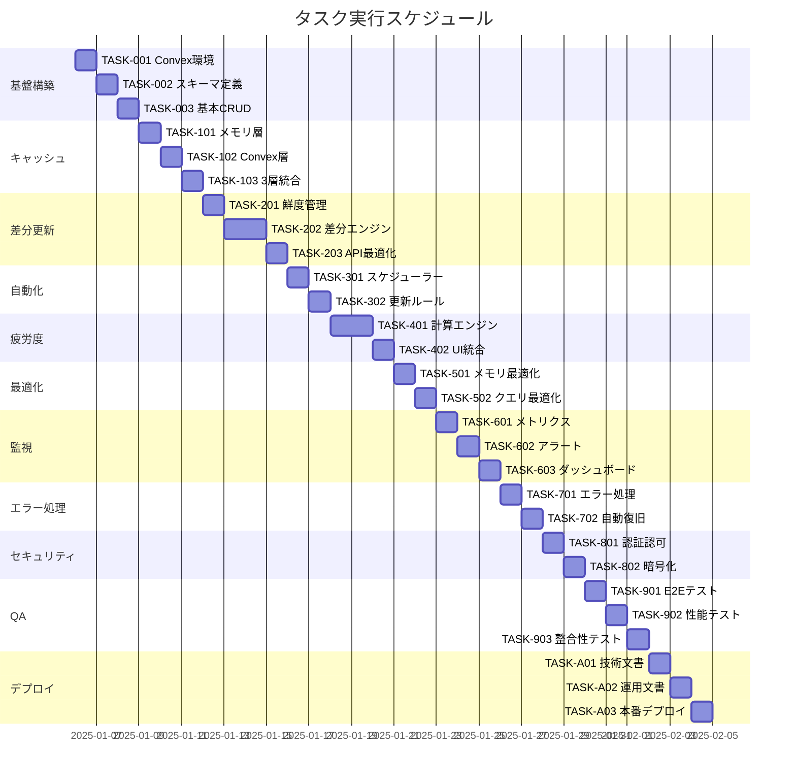

# Convex Cache System 実装タスク

## 概要

全タスク数: 42
推定作業時間: 126時間（約3週間）
クリティカルパス: TASK-001 → TASK-002 → TASK-003 → TASK-101 → TASK-102 → TASK-103 → TASK-201 → TASK-202 → TASK-301

## タスク一覧

### フェーズ1: 基盤構築

#### TASK-001: Convex環境セットアップ

- [x] **タスク完了**
- **タスクタイプ**: DIRECT
- **要件リンク**: REQ-401, REQ-402
- **依存タスク**: なし
- **実装詳細**:
  - Convexプロジェクトの初期化
  - 認証設定（@convex-dev/auth）
  - 環境変数設定（Meta API認証情報）
  - 開発環境・本番環境の設定
- **テスト要件**:
  - [ ] Convex接続確認テスト
  - [ ] 認証フロー動作確認
  - [ ] 環境変数読み込みテスト
- **完了条件**:
  - [ ] Convexダッシュボードへのアクセス可能
  - [ ] 開発環境でのHMR動作確認
  - [ ] 認証トークンの保存・取得可能

#### TASK-002: Convexスキーマ定義

- [x] **タスク完了**
- **タスクタイプ**: DIRECT
- **要件リンク**: REQ-001, REQ-002, REQ-003
- **依存タスク**: TASK-001
- **実装詳細**:
  - `convex/schema.ts`の作成
  - metaInsightsテーブル定義
  - dataFreshnessテーブル定義
  - fatigueScoresテーブル定義
  - インデックス設定（account_id, date_range, cache_key）
- **テスト要件**:
  - [ ] スキーマバリデーションテスト
  - [ ] インデックス効率性テスト
  - [ ] データ整合性テスト
- **完了条件**:
  - [ ] 全テーブルがConvexダッシュボードに表示
  - [ ] インデックスが正しく設定されている
  - [ ] スキーマのマイグレーション可能

#### TASK-003: 基本CRUD Functions実装

- [x] **タスク完了**
- **タスクタイプ**: TDD
- **要件リンク**: REQ-101, REQ-102, REQ-103
- **依存タスク**: TASK-002
- **実装詳細**:
  - `convex/metaInsights.ts`のCRUD実装
  - `convex/dataFreshness.ts`のCRUD実装
  - エラーハンドリング
  - 権限チェック機能
- **テスト要件**:
  - [ ] 単体テスト: CRUD操作
  - [ ] 統合テスト: データベース操作
  - [ ] 権限テスト: アクセス制御
- **エラーハンドリング**:
  - [ ] 不正なデータ型
  - [ ] 権限エラー
  - [ ] データベース接続エラー
- **完了条件**:
  - [ ] 全CRUD操作が正常動作
  - [ ] エラーハンドリング実装済み
  - [ ] 権限チェック機能動作

### フェーズ2: キャッシュシステム実装

#### TASK-101: メモリキャッシュレイヤー実装

- [x] **タスク完了**
- **タスクタイプ**: TDD
- **要件リンク**: REQ-201, REQ-202
- **依存タスク**: TASK-003
- **実装詳細**:
  - L1キャッシュの実装（useRef<Map>）
  - LRU削除アルゴリズム
  - メモリ使用量制限（50MB）
  - キャッシュヒット率計測
- **テスト要件**:
  - [ ] 単体テスト: キャッシュ操作
  - [ ] パフォーマンステスト: 10ms以内の応答
  - [ ] メモリテスト: 制限内での動作
- **UI/UX要件**:
  - [ ] キャッシュヒット時の即座表示
  - [ ] メモリ使用量インジケーター
- **完了条件**:
  - [ ] 10ms以内の応答時間
  - [ ] メモリ制限の遵守
  - [ ] LRU削除の正常動作

#### TASK-102: Convexキャッシュレイヤー実装

- [x] **タスク完了**
- **タスクタイプ**: TDD
- **要件リンク**: REQ-203, REQ-204, REQ-205
- **依存タスク**: TASK-101
- **実装詳細**:
  - L2キャッシュの実装（Convex Queries）
  - リアクティブクエリ設定
  - WebSocket同期機能
  - キャッシュ無効化ロジック
- **テスト要件**:
  - [ ] 単体テスト: Convexクエリ
  - [ ] 統合テスト: リアルタイム同期
  - [ ] パフォーマンステスト: 100ms以内の応答
- **UI/UX要件**:
  - [ ] リアルタイム更新の視覚的フィードバック
  - [ ] 同期状態インジケーター
- **完了条件**:
  - [ ] 100ms以内の応答時間
  - [ ] リアルタイム同期動作
  - [ ] 複数タブ間での一貫性

#### TASK-103: 3層キャッシュ統合

- [x] **タスク完了**
- **タスクタイプ**: TDD
- **要件リンク**: REQ-206, REQ-207
- **依存タスク**: TASK-102
- **実装詳細**:
  - `useConvexCache` Hook実装
  - フォールバック機構
  - キャッシュキー生成ロジック
  - 統合エラーハンドリング
- **テスト要件**:
  - [ ] 統合テスト: 3層フォールバック
  - [ ] エラーテスト: 各層のエラー処理
  - [ ] パフォーマンステスト: キャッシュヒット率95%以上
- **エラーハンドリング**:
  - [ ] メモリ不足時のフォールバック
  - [ ] Convex接続エラー時の処理
  - [ ] API障害時のキャッシュ利用
- **完了条件**:
  - [ ] 95%以上のキャッシュヒット率
  - [ ] 全層でのエラー回復
  - [ ] シームレスなフォールバック

### フェーズ3: 差分更新システム

#### TASK-201: データ鮮度管理システム

- [ ] **タスク完了**
- **タスクタイプ**: TDD
- **要件リンク**: REQ-301, REQ-302, REQ-303
- **依存タスク**: TASK-103
- **実装詳細**:
  - `convex/freshnessManager.ts`実装
  - 鮮度状態の自動判定
  - 更新優先度アルゴリズム
  - 日付範囲別ルール設定
- **テスト要件**:
  - [ ] 単体テスト: 鮮度判定ロジック
  - [ ] 統合テスト: 自動更新トリガー
  - [ ] タイミングテスト: 更新間隔の検証
- **完了条件**:
  - [ ] 正確な鮮度判定
  - [ ] 適切な更新タイミング
  - [ ] 優先度に基づく更新

#### TASK-202: 差分取得エンジン実装

- [ ] **タスク完了**
- **タスクタイプ**: TDD
- **要件リンク**: REQ-304, REQ-305, REQ-306
- **依存タスク**: TASK-201
- **実装詳細**:
  - `convex/differentialEngine.ts`実装
  - 必要データ範囲の計算
  - Meta API差分呼び出し
  - データマージ・重複排除
  - API使用量最適化
- **テスト要件**:
  - [ ] 単体テスト: 差分計算ロジック
  - [ ] 統合テスト: API呼び出し最適化
  - [ ] 削減率テスト: 90%以上のAPI削減
- **完了条件**:
  - [ ] 90%以上のAPI呼び出し削減
  - [ ] 正確な差分取得
  - [ ] データ重複なし

#### TASK-203: Meta API統合最適化

- [ ] **タスク完了**
- **タスクタイプ**: TDD
- **要件リンク**: REQ-307, REQ-308
- **依存タスク**: TASK-202
- **実装詳細**:
  - `convex/metaApiClient.ts`実装
  - レート制限管理
  - バッチ処理機能
  - 指数バックオフリトライ
  - エラー回復機構
- **テスト要件**:
  - [ ] 単体テスト: API呼び出しロジック
  - [ ] 統合テスト: レート制限遵守
  - [ ] 負荷テスト: 並列処理効率
- **エラーハンドリング**:
  - [ ] レート制限エラー
  - [ ] 認証エラー
  - [ ] ネットワークエラー
  - [ ] タイムアウト処理
- **完了条件**:
  - [ ] レート制限内での動作
  - [ ] 自動リトライ機能
  - [ ] エラー時の適切な回復

### フェーズ4: 自動化・スケジューラー

#### TASK-301: Convex Scheduled Functions実装

- [ ] **タスク完了**
- **タスクタイプ**: TDD
- **要件リンク**: REQ-401, REQ-402, REQ-403
- **依存タスク**: TASK-203
- **実装詳細**:
  - `convex/scheduledFunctions.ts`実装
  - 定期更新ジョブ設定
  - データ鮮度チェックジョブ
  - クリーンアップジョブ
  - ジョブ実行ログ
- **テスト要件**:
  - [ ] 単体テスト: スケジューラーロジック
  - [ ] 統合テスト: ジョブ実行フロー
  - [ ] タイミングテスト: 実行間隔検証
- **完了条件**:
  - [ ] 10分間隔での定期実行
  - [ ] エラー時の自動復旧
  - [ ] ログの適切な記録

#### TASK-302: 更新ルールエンジン

- [ ] **タスク完了**
- **タスクタイプ**: TDD
- **要件リンク**: REQ-404, REQ-405
- **依存タスク**: TASK-301
- **実装詳細**:
  - `convex/updateRulesEngine.ts`実装
  - 時間帯別更新ルール
  - アカウント別最適化
  - 予測的更新アルゴリズム
  - 使用パターン分析
- **テスト要件**:
  - [ ] 単体テスト: ルール評価ロジック
  - [ ] 統合テスト: 自動更新フロー
  - [ ] 効率性テスト: 更新頻度最適化
- **完了条件**:
  - [ ] インテリジェントな更新タイミング
  - [ ] 使用パターンの学習
  - [ ] API使用量の最小化

### フェーズ5: 疲労度分析システム

#### TASK-401: 疲労度計算エンジン実装

- [ ] **タスク完了**
- **タスクタイプ**: TDD
- **要件リンク**: REQ-501, REQ-502, REQ-503
- **依存タスク**: TASK-302
- **実装詳細**:
  - `convex/fatigueCalculator.ts`実装
  - 3つの疲労度指標計算
  - 総合スコアアルゴリズム
  - リアルタイム更新
- **テスト要件**:
  - [ ] 単体テスト: 計算ロジック
  - [ ] 統合テスト: データフロー
  - [ ] 精度テスト: スコア妥当性
- **完了条件**:
  - [ ] 0-100スコアの正確な計算
  - [ ] リアルタイム更新
  - [ ] 3指標の適切な重み付け

#### TASK-402: 疲労度UI統合

- [ ] **タスク完了**
- **タスクタイプ**: TDD
- **要件リンク**: REQ-504, REQ-505
- **依存タスク**: TASK-401
- **実装詳細**:
  - AdFatigueページとの統合
  - スコア表示コンポーネント
  - トレンドグラフ
  - アラート機能
- **UI/UX要件**:
  - [ ] 視覚的なスコア表示（ゲージ/バー）
  - [ ] 色分けによる危険度表示
  - [ ] トレンドグラフでの推移表示
  - [ ] モバイルレスポンシブ対応
  - [ ] アクセシビリティ: スクリーンリーダー対応
- **テスト要件**:
  - [ ] コンポーネントテスト
  - [ ] 視覚回帰テスト
  - [ ] レスポンシブテスト
- **完了条件**:
  - [ ] 直感的なスコア表示
  - [ ] リアルタイム更新の反映
  - [ ] モバイル対応完了

### フェーズ6: パフォーマンス最適化

#### TASK-501: メモリ使用量最適化

- [ ] **タスク完了**
- **タスクタイプ**: TDD
- **要件リンク**: REQ-601, REQ-602
- **依存タスク**: TASK-402
- **実装詳細**:
  - メモリプロファイリング
  - LRUアルゴリズム改善
  - データ構造最適化
  - メモリリーク対策
- **テスト要件**:
  - [ ] メモリ使用量テスト
  - [ ] 長時間稼働テスト
  - [ ] メモリリークテスト
- **完了条件**:
  - [ ] 50MB以下のメモリ使用
  - [ ] メモリリークなし
  - [ ] 効率的なガベージコレクション

#### TASK-502: クエリパフォーマンス最適化

- [ ] **タスク完了**
- **タスクタイプ**: TDD
- **要件リンク**: REQ-603, REQ-604
- **依存タスク**: TASK-501
- **実装詳細**:
  - Convexクエリ最適化
  - インデックス再設計
  - バッチクエリ実装
  - 並列処理改善
- **テスト要件**:
  - [ ] パフォーマンステスト: P95 < 100ms
  - [ ] 負荷テスト: 10アカウント同時
  - [ ] スケーラビリティテスト
- **完了条件**:
  - [ ] P95応答時間 < 100ms
  - [ ] 10アカウント同時処理可能
  - [ ] スムーズなスケーリング

### フェーズ7: 監視・アラート

#### TASK-601: メトリクス収集システム

- [ ] **タスク完了**
- **タスクタイプ**: TDD
- **要件リンク**: REQ-701, REQ-702
- **依存タスク**: TASK-502
- **実装詳細**:
  - `convex/metrics.ts`実装
  - システムメトリクス収集
  - パフォーマンス統計
  - 使用量追跡
- **テスト要件**:
  - [ ] 単体テスト: メトリクス計算
  - [ ] 統合テスト: データ収集フロー
  - [ ] 精度テスト: 統計の正確性
- **完了条件**:
  - [ ] リアルタイムメトリクス収集
  - [ ] 正確な統計情報
  - [ ] 履歴データの保存

#### TASK-602: アラート機能実装

- [ ] **タスク完了**
- **タスクタイプ**: TDD
- **要件リンク**: REQ-703, REQ-704
- **依存タスク**: TASK-601
- **実装詳細**:
  - `convex/alerting.ts`実装
  - 閾値設定機能
  - 通知ロジック
  - エスカレーション機能
- **テスト要件**:
  - [ ] 単体テスト: アラート条件評価
  - [ ] 統合テスト: 通知フロー
  - [ ] シナリオテスト: 各種アラート
- **UI/UX要件**:
  - [ ] トースト通知
  - [ ] アラート履歴画面
  - [ ] 設定画面
- **完了条件**:
  - [ ] 適切なアラート発火
  - [ ] 通知の確実な配信
  - [ ] アラート履歴の記録

#### TASK-603: 監視ダッシュボード実装

- [ ] **タスク完了**
- **タスクタイプ**: TDD
- **要件リンク**: REQ-705, REQ-706
- **依存タスク**: TASK-602
- **実装詳細**:
  - ダッシュボードUI実装
  - リアルタイムグラフ
  - メトリクス表示
  - システムステータス
- **UI/UX要件**:
  - [ ] リアルタイムグラフ更新
  - [ ] レスポンシブレイアウト
  - [ ] ダークモード対応
  - [ ] ドリルダウン機能
  - [ ] エクスポート機能
- **テスト要件**:
  - [ ] コンポーネントテスト
  - [ ] E2Eテスト: ダッシュボード操作
  - [ ] パフォーマンステスト
- **完了条件**:
  - [ ] リアルタイム更新
  - [ ] 直感的なUI
  - [ ] モバイル対応

### フェーズ8: エラー処理・復旧

#### TASK-701: 包括的エラーハンドリング

- [ ] **タスク完了**
- **タスクタイプ**: TDD
- **要件リンク**: REQ-801, REQ-802
- **依存タスク**: TASK-603
- **実装詳細**:
  - グローバルエラーハンドラー
  - エラー分類システム
  - コンテキスト保存
  - ユーザーフィードバック
- **テスト要件**:
  - [ ] 単体テスト: エラー処理ロジック
  - [ ] 統合テスト: エラー伝播
  - [ ] シナリオテスト: 各種エラー
- **エラーハンドリング**:
  - [ ] ネットワークエラー
  - [ ] 認証エラー
  - [ ] データ不整合
  - [ ] システムエラー
- **完了条件**:
  - [ ] 全エラーの適切な処理
  - [ ] ユーザーへの明確なフィードバック
  - [ ] エラーログの記録

#### TASK-702: 自動復旧システム

- [ ] **タスク完了**
- **タスクタイプ**: TDD
- **要件リンク**: REQ-803, REQ-804
- **依存タスク**: TASK-701
- **実装詳細**:
  - `utils/autoRecovery.ts`実装
  - サーキットブレーカー
  - 指数バックオフ
  - フェイルオーバー機構
- **テスト要件**:
  - [ ] 単体テスト: 復旧ロジック
  - [ ] 統合テスト: 障害シナリオ
  - [ ] カオステスト: ランダム障害
- **完了条件**:
  - [ ] 自動復旧の成功率90%以上
  - [ ] 適切なフェイルオーバー
  - [ ] サービス継続性の確保

### フェーズ9: セキュリティ実装

#### TASK-801: 認証・認可システム

- [ ] **タスク完了**
- **タスクタイプ**: TDD
- **要件リンク**: REQ-901, REQ-902
- **依存タスク**: TASK-702
- **実装詳細**:
  - Convex Auth統合
  - アカウント別アクセス制御
  - トークン管理
  - セッション管理
- **テスト要件**:
  - [ ] セキュリティテスト: 認証フロー
  - [ ] 権限テスト: アクセス制御
  - [ ] ペネトレーションテスト
- **完了条件**:
  - [ ] 安全な認証フロー
  - [ ] 適切な権限管理
  - [ ] セッションの安全な管理

#### TASK-802: データ暗号化実装

- [ ] **タスク完了**
- **タスクタイプ**: TDD
- **要件リンク**: REQ-903, REQ-904
- **依存タスク**: TASK-801
- **実装詳細**:
  - APIトークン暗号化（AES-256）
  - 機密データ暗号化
  - 暗号化キー管理
  - ログサニタイゼーション
- **テスト要件**:
  - [ ] 暗号化テスト
  - [ ] 復号化テスト
  - [ ] セキュリティ監査
- **完了条件**:
  - [ ] 全機密データの暗号化
  - [ ] 安全なキー管理
  - [ ] ログから機密情報除外

### フェーズ10: 統合テスト・品質保証

#### TASK-901: E2Eテストスイート

- [ ] **タスク完了**
- **タスクタイプ**: TDD
- **要件リンク**: 全要件
- **依存タスク**: TASK-802
- **実装詳細**:
  - Playwright/Cypressセットアップ
  - 主要ユーザーフローテスト
  - クロスブラウザテスト
  - モバイルテスト
- **テスト要件**:
  - [ ] ログイン→データ取得フロー
  - [ ] キャッシュ動作フロー
  - [ ] エラー回復フロー
  - [ ] 疲労度分析フロー
- **完了条件**:
  - [ ] 全主要フローのカバー
  - [ ] 全ブラウザでの動作確認
  - [ ] モバイル動作確認

#### TASK-902: パフォーマンステスト

- [ ] **タスク完了**
- **タスクタイプ**: TDD
- **要件リンク**: REQ-A01, REQ-A02, REQ-A03
- **依存タスク**: TASK-901
- **実装詳細**:
  - 負荷テストシナリオ作成
  - 並行アクセステスト
  - メモリリークテスト
  - 長時間稼働テスト
- **テスト要件**:
  - [ ] 10アカウント同時アクセス
  - [ ] 24時間連続稼働
  - [ ] 大量データ処理
  - [ ] ストレステスト
- **完了条件**:
  - [ ] 全非機能要件の達成
  - [ ] ボトルネックの特定・解消
  - [ ] 安定した長時間稼働

#### TASK-903: データ整合性テスト

- [ ] **タスク完了**
- **タスクタイプ**: TDD
- **要件リンク**: REQ-001, REQ-401
- **依存タスク**: TASK-902
- **実装詳細**:
  - データ重複チェック
  - 同期テスト
  - 複数タブテスト
  - 障害回復テスト
- **テスト要件**:
  - [ ] データ一貫性検証
  - [ ] タブ間同期検証
  - [ ] 障害時データ保護
  - [ ] 復旧後整合性確認
- **完了条件**:
  - [ ] 0%のデータ不整合
  - [ ] 完全なタブ間同期
  - [ ] データロスなし

### フェーズ11: ドキュメント・デプロイ

#### TASK-A01: 技術ドキュメント作成

- [ ] **タスク完了**
- **タスクタイプ**: DIRECT
- **要件リンク**: 全要件
- **依存タスク**: TASK-903
- **実装詳細**:
  - APIドキュメント
  - アーキテクチャドキュメント
  - デプロイメントガイド
  - トラブルシューティングガイド
- **完了条件**:
  - [ ] 完全なAPI仕様書
  - [ ] 図表付きアーキテクチャ説明
  - [ ] ステップバイステップガイド

#### TASK-A02: 運用マニュアル作成

- [ ] **タスク完了**
- **タスクタイプ**: DIRECT
- **要件リンク**: 運用要件
- **依存タスク**: TASK-A01
- **実装詳細**:
  - 日常運用手順
  - 監視・アラート対応
  - バックアップ・リストア手順
  - 災害復旧手順
- **完了条件**:
  - [ ] 運用チームレビュー完了
  - [ ] 手順の実地検証完了
  - [ ] ランブック作成完了

#### TASK-A03: 本番環境デプロイ

- [ ] **タスク完了**
- **タスクタイプ**: DIRECT
- **要件リンク**: 全要件
- **依存タスク**: TASK-A02
- **実装詳細**:
  - 本番環境設定
  - Convex本番プロジェクト設定
  - 環境変数設定
  - 監視設定
  - 段階的ロールアウト
- **テスト要件**:
  - [ ] スモークテスト
  - [ ] 本番データ移行テスト
  - [ ] ロールバック手順確認
- **完了条件**:
  - [ ] 本番環境稼働開始
  - [ ] 監視ダッシュボード稼働
  - [ ] 初期ユーザーフィードバック収集

## 実行順序

## マイルストーン

### M1: 基盤完成（Day 3）
- Convex環境構築完了
- データベーススキーマ実装
- 基本CRUD機能動作

### M2: キャッシュシステム完成（Day 6）
- 3層キャッシュ統合完了
- リアルタイム同期動作
- 95%キャッシュヒット率達成

### M3: 差分更新システム完成（Day 10）
- 差分更新エンジン稼働
- 90% API削減達成
- 自動更新スケジューラー動作

### M4: 疲労度分析完成（Day 13）
- 疲労度計算エンジン稼働
- UIへの統合完了
- リアルタイムスコア表示

### M5: 品質保証完了（Day 20）
- 全テスト合格
- パフォーマンス目標達成
- セキュリティ監査完了

### M6: 本番稼働開始（Day 21）
- 本番環境デプロイ完了
- 監視システム稼働
- 初期運用開始

## リスクと対策

### 技術リスク
1. **Convex制限超過**
   - 対策: 使用量監視、段階的スケールアップ
   
2. **Meta API変更**
   - 対策: v23.0固定、変更監視

3. **パフォーマンス未達**
   - 対策: 早期プロファイリング、段階的最適化

### プロジェクトリスク
1. **スケジュール遅延**
   - 対策: 日次進捗確認、バッファ確保

2. **品質問題**
   - 対策: TDD徹底、継続的テスト

## 並行実行可能タスク

以下のタスクグループは並行実行可能：

**グループ1（Day 7-8）:**
- TASK-301: スケジューラー実装
- TASK-401: 疲労度計算エンジン（基礎部分）

**グループ2（Day 14-15）:**
- TASK-501: メモリ最適化
- TASK-601: メトリクス収集

**グループ3（Day 18-19）:**
- TASK-801: 認証・認可
- TASK-A01: 技術ドキュメント（ドラフト）

## 成功指標

### 技術KPI
- ✅ キャッシュヒット率: 95%以上
- ✅ API呼び出し削減: 90%以上
- ✅ 応答時間: P95 < 100ms
- ✅ データ不整合: 0%
- ✅ システム稼働率: 99.9%

### ビジネスKPI
- ✅ ユーザー満足度向上
- ✅ 運用コスト削減（月額$450）
- ✅ 手動介入ゼロ化

## 注意事項

1. **TDDプロセスの徹底**
   - 各TDDタスクは必ずテストファースト開発
   - Red → Green → Refactorサイクルの遵守

2. **段階的実装**
   - クリティカルパスを優先
   - 各マイルストーンでの動作確認

3. **継続的統合**
   - 日次でのコード統合
   - 自動テストの継続実行

4. **ドキュメント更新**
   - コードと同時にドキュメント更新
   - APIドキュメントの自動生成活用