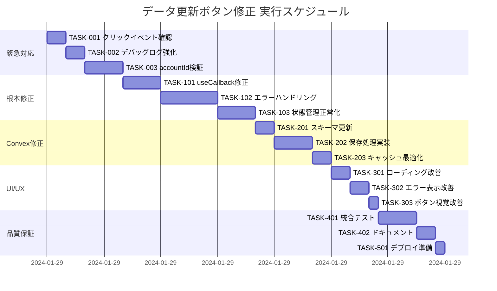

# データ更新ボタン機能不全解決 実装タスク

## 概要

全タスク数: 15
推定作業時間: 16時間
クリティカルパス: TASK-001 → TASK-002 → TASK-003 → TASK-101 → TASK-102 → TASK-201 → TASK-301

## タスク一覧

### フェーズ1: 緊急対応（即時実装）

#### TASK-001: 基本的なクリックイベント動作確認

- [ ] **タスク完了**
- **タスクタイプ**: DIRECT
- **要件リンク**: REQ-401, EDGE-004
- **依存タスク**: なし
- **実装詳細**:
  - FatigueDashboardPresentationにテスト用アラートボタンを一時的に追加
  - ボタンクリックイベントが正常に発火することを確認
  - ブラウザコンソールでエラーの有無を確認
- **テスト要件**:
  - [ ] ボタンクリックでアラートが表示される
  - [ ] コンソールにエラーが出力されない
- **完了条件**:
  - [ ] 基本的なクリックイベントが動作する
  - [ ] JavaScriptエラーが発生しない

#### TASK-002: デバッグログの強化

- [ ] **タスク完了**
- **タスクタイプ**: DIRECT
- **要件リンク**: REQ-401, NFR-301, NFR-302
- **依存タスク**: TASK-001
- **実装詳細**:
  - FatigueDashboardPresentationのボタンクリックハンドラーにログ追加
  - useAdFatigueSimplifiedのrefetch関数にエントリーログ追加
  - エラー時の詳細情報（timestamp、accountId、error詳細）をログ出力
- **テスト要件**:
  - [ ] ボタンクリック時にデバッグ情報が出力される
  - [ ] refetch関数の開始が確認できる
- **完了条件**:
  - [ ] 全ての重要な処理ポイントでログが出力される
  - [ ] エラー時の診断に必要な情報が記録される

#### TASK-003: accountId検証の実装

- [ ] **タスク完了**
- **タスクタイプ**: TDD
- **要件リンク**: REQ-101, EDGE-001, VAL_001
- **依存タスク**: TASK-002
- **実装詳細**:
  - useAdFatigueSimplifiedのrefetch関数でaccountId存在チェック
  - accountIdが空の場合の早期リターン処理
  - 適切なエラーメッセージの設定
- **テスト要件**:
  - [ ] accountIdが空の場合にrefetchが実行されない
  - [ ] 適切なエラーログが出力される
  - [ ] ボタンが無効化状態になる
- **UI/UX要件**:
  - [ ] エラー表示: 「アカウントを選択してください」メッセージ
  - [ ] ボタン状態: disabled属性でグレーアウト
- **完了条件**:
  - [ ] accountId未選択時の動作が正しい
  - [ ] ユーザーフレンドリーなメッセージが表示される

### フェーズ2: 根本原因修正（1日以内）

#### TASK-101: useCallbackの依存配列修正

- [ ] **タスク完了**
- **タスクタイプ**: TDD
- **要件リンク**: REQ-403, NFR-102
- **依存タスク**: TASK-003
- **実装詳細**:
  - useAdFatigueSimplifiedのrefetch関数の依存配列を見直し
  - 不要な依存（lastRefreshTime等）を削除
  - 必要な依存（accountId、cache、api等）を確認
- **テスト要件**:
  - [ ] 依存配列の変更により無限ループが発生しない
  - [ ] メモリリークが発生しない
  - [ ] 関数参照が正しく更新される
- **完了条件**:
  - [ ] React Hook の警告が出ない
  - [ ] 正しいタイミングで関数が再生成される

#### TASK-102: エラーハンドリングの強化

- [ ] **タスク完了**
- **タスクタイプ**: TDD
- **要件リンク**: REQ-402, REQ-103, REQ-104, NFR-101
- **依存タスク**: TASK-101
- **実装詳細**:
  - try-catchブロックで全ての非同期処理をラップ
  - エラータイプ別の処理実装（AUTH_ERROR、NETWORK_ERROR等）
  - エラー時の状態リセット処理
- **テスト要件**:
  - [ ] 各エラータイプで適切なメッセージが表示される
  - [ ] エラー後もアプリケーションがクラッシュしない
  - [ ] リトライが可能な状態になる
- **エラーハンドリング**:
  - [ ] Meta API 認証エラー（401）
  - [ ] ネットワークタイムアウト（30秒）
  - [ ] Convex保存エラー
  - [ ] 予期しないエラー
- **完了条件**:
  - [ ] 全てのエラーケースが適切に処理される
  - [ ] ユーザーに分かりやすいメッセージが表示される

#### TASK-103: 状態管理の正常化

- [ ] **タスク完了**
- **タスクタイプ**: TDD
- **要件リンク**: REQ-102, REQ-201, REQ-202
- **依存タスク**: TASK-102
- **実装詳細**:
  - isRefreshing状態の管理を確実にする
  - コンポーネントアンマウント時の処理追加
  - 重複リクエスト防止の実装
- **テスト要件**:
  - [ ] 連続クリックで重複リクエストが発生しない
  - [ ] 処理中はボタンが「更新中...」と表示される
  - [ ] アンマウント後の状態更新でエラーが出ない
- **完了条件**:
  - [ ] 状態遷移が正しく機能する
  - [ ] メモリリークが発生しない

### フェーズ3: Convexデータフロー修正

#### TASK-201: Convexスキーマ更新の適用

- [ ] **タスク完了**
- **タスクタイプ**: DIRECT
- **要件リンク**: REQ-002
- **依存タスク**: TASK-103
- **実装詳細**:
  - metaInsightsテーブルにadset_id、adset_nameフィールド追加（実装済み）
  - インデックスの作成
  - 既存データのマイグレーション（必要な場合）
- **テスト要件**:
  - [ ] スキーマ変更が正しく適用される
  - [ ] 新規データの保存が成功する
- **完了条件**:
  - [ ] Convexダッシュボードでスキーマが確認できる
  - [ ] エラーなくデータ保存ができる

#### TASK-202: API→Convex保存処理の実装

- [ ] **タスク完了**
- **タスクタイプ**: TDD
- **要件リンク**: REQ-001, REQ-002, EDGE-003
- **依存タスク**: TASK-201
- **実装詳細**:
  - useInsightsCacheのsaveToCache実装（実装済み）
  - importInsights mutationの呼び出し
  - エラー時のリトライ処理
- **テスト要件**:
  - [ ] APIデータが正しくConvexに保存される
  - [ ] adset情報が保持される
  - [ ] 保存失敗時にAPIデータが保持される
- **完了条件**:
  - [ ] データフローが API → Convex → UI となる
  - [ ] 広告セット情報が正しく表示される

#### TASK-203: キャッシュ戦略の最適化

- [ ] **タスク完了**
- **タスクタイプ**: TDD
- **要件リンク**: REQ-002, NFR-001
- **依存タスク**: TASK-202
- **実装詳細**:
  - preferCacheフラグの適切な利用
  - キャッシュクリア機能の実装
  - データソース表示の更新
- **テスト要件**:
  - [ ] キャッシュ優先時の動作確認
  - [ ] 強制更新時の動作確認
  - [ ] データソースが正しく表示される
- **完了条件**:
  - [ ] パフォーマンス要件を満たす
  - [ ] データの新鮮度が保たれる

### フェーズ4: UI/UX改善

#### TASK-301: ローディング状態の改善

- [ ] **タスク完了**
- **タスクタイプ**: TDD
- **要件リンク**: REQ-003, REQ-201, NFR-203
- **依存タスク**: TASK-203
- **実装詳細**:
  - ローディングオーバーレイの実装（修正済み）
  - プログレスバー表示（オプション）
  - アニメーション改善
- **UI/UX要件**:
  - [ ] ローディング状態: 半透明オーバーレイ + スピナー
  - [ ] テキスト表示: 「データを更新中...」
  - [ ] アクセシビリティ: aria-busy属性
- **テスト要件**:
  - [ ] ローディング表示が明確に視認できる
  - [ ] 処理完了後に正しく非表示になる
- **完了条件**:
  - [ ] ユーザーが処理中であることを認識できる
  - [ ] UIがフリーズしているように見えない

#### TASK-302: エラーフィードバックの実装

- [ ] **タスク完了**
- **タスクタイプ**: TDD
- **要件リンク**: REQ-103, REQ-104, REQ-202, NFR-202
- **依存タスク**: TASK-301
- **実装詳細**:
  - エラーメッセージコンポーネントの改善
  - エラータイプ別のアイコン表示
  - リトライボタンの追加
- **UI/UX要件**:
  - [ ] エラー表示: トースト通知 or インラインアラート
  - [ ] メッセージ: 非技術的な表現
  - [ ] アクション: 解決方法の提示
  - [ ] モバイル対応: レスポンシブ表示
- **テスト要件**:
  - [ ] 各エラータイプで適切な表示
  - [ ] メッセージが理解しやすい
- **完了条件**:
  - [ ] ユーザーが次のアクションを理解できる
  - [ ] エラーが脅威的でない

#### TASK-303: ボタンの視覚的改善

- [ ] **タスク完了**
- **タスクタイプ**: DIRECT
- **要件リンク**: NFR-201, NFR-001
- **依存タスク**: TASK-302
- **実装詳細**:
  - ボタンの状態別スタイリング強化
  - ホバー/フォーカス状態の改善
  - クリックフィードバック追加
- **UI/UX要件**:
  - [ ] 通常状態: インディゴ背景
  - [ ] ホバー状態: 暗めのインディゴ
  - [ ] 無効状態: グレー背景 + not-allowedカーソル
  - [ ] フォーカス状態: アウトライン表示
- **完了条件**:
  - [ ] 100ms以内の反応速度
  - [ ] 状態が明確に区別できる

### フェーズ5: テストと品質保証

#### TASK-401: 統合テストの実装

- [ ] **タスク完了**
- **タスクタイプ**: TDD
- **要件リンク**: 全機能要件
- **依存タスク**: TASK-303
- **実装詳細**:
  - データ更新フロー全体のE2Eテスト
  - エラーケースのシナリオテスト
  - パフォーマンステスト
- **テスト要件**:
  - [ ] 正常系フローのテスト
  - [ ] 各エラーケースのテスト
  - [ ] 境界値テスト
- **完了条件**:
  - [ ] 全ての受け入れ基準を満たす
  - [ ] パフォーマンス要件を達成

#### TASK-402: ドキュメント更新

- [ ] **タスク完了**
- **タスクタイプ**: DIRECT
- **要件リンク**: NFR-301, NFR-302
- **依存タスク**: TASK-401
- **実装詳細**:
  - 開発者向けトラブルシューティングガイド作成
  - エラーコード一覧の更新
  - デバッグ手順の文書化
- **完了条件**:
  - [ ] 問題発生時の対処法が明確
  - [ ] 新規開発者が理解できる

#### TASK-501: 本番環境デプロイ準備

- [ ] **タスク完了**
- **タスクタイプ**: DIRECT
- **要件リンク**: 全要件
- **依存タスク**: TASK-402
- **実装詳細**:
  - 環境変数の確認
  - Convex本番環境の設定
  - モニタリング設定
- **完了条件**:
  - [ ] 本番環境で動作確認完了
  - [ ] ロールバック手順の確立

## 実行順序

## 並行実行可能タスク

以下のタスクは依存関係がないため並行実行可能：

- **フェーズ1完了後**: なし（順次実行が必要）
- **フェーズ2**: TASK-101とTASK-201（スキーマ更新）は並行可能
- **フェーズ4**: TASK-301、TASK-302、TASK-303は独立して実装可能

## 完了条件チェックリスト

- [ ] データ更新ボタンがクリック可能
- [ ] クリック時にMeta APIからデータ取得
- [ ] 取得データがConvexに保存される
- [ ] 広告セット情報が正しく表示される
- [ ] エラー時に適切なメッセージ表示
- [ ] 全てのテストがパス
- [ ] ドキュメントが更新済み