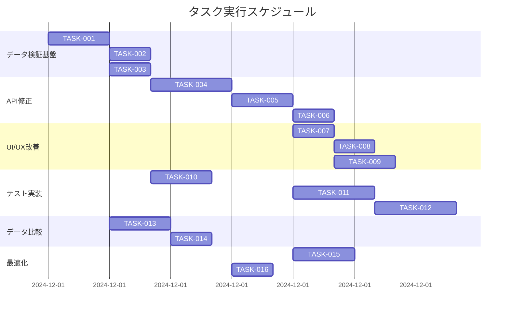

# 日付範囲フィルター機能 実装タスク

## 概要

全タスク数: 16
推定作業時間: 45時間
クリティカルパス: TASK-001 → TASK-002 → TASK-004 → TASK-005 → TASK-007 → TASK-008 → TASK-012

## タスク一覧

### フェーズ1: データ検証基盤

#### TASK-001: DataValidatorクラスの実装

- [ ] **タスク完了**
- **タスクタイプ**: TDD
- **要件リンク**: REQ-001, REQ-401
- **依存タスク**: なし
- **実装詳細**:
  - データ検証・正規化の基本クラス実装
  - 数値正規化メソッド
  - メトリクス検証メソッド
  - 通貨変換メソッド
- **テスト要件**:
  - [ ] 単体テスト: normalizeNumericValues()
  - [ ] 単体テスト: validateMetrics()
  - [ ] 単体テスト: applyCurrencyConversion()
- **完了条件**:
  - [ ] 全メソッドが実装されている
  - [ ] 全テストが合格している
  - [ ] TypeScript型が正しく定義されている

#### TASK-002: 数値正規化ユーティリティの実装

- [ ] **タスク完了**
- **タスクタイプ**: TDD
- **要件リンク**: REQ-002, NFR-302
- **依存タスク**: TASK-001
- **実装詳細**:
  - パーセンテージ正規化
  - タイムゾーン調整
  - 丸め処理の実装
- **テスト要件**:
  - [ ] 単体テスト: normalizePercentage()
  - [ ] 単体テスト: normalizeDateWithTimezone()
  - [ ] 境界値テスト: 0%, 100%, 負の値
- **完了条件**:
  - [ ] 通貨変換が正しく動作する
  - [ ] タイムゾーン変換が正しく動作する
  - [ ] パーセンテージ変換が正しく動作する

#### TASK-003: デバッグセッションクラスの実装

- [ ] **タスク完了**
- **タスクタイプ**: TDD
- **要件リンク**: NFR-201, NFR-203
- **依存タスク**: TASK-001
- **実装詳細**:
  - DebugSessionクラスの実装
  - APIトレース機能
  - パフォーマンス計測
  - エラー記録
- **テスト要件**:
  - [ ] 単体テスト: traceApiRequest()
  - [ ] 単体テスト: traceDataProcessing()
  - [ ] 統合テスト: セッション全体のトレース
- **完了条件**:
  - [ ] デバッグ情報が正しく記録される
  - [ ] localStorageへの保存が動作する
  - [ ] エクスポート機能が動作する

### フェーズ2: API修正

#### TASK-004: Meta API クライアントの修正

- [ ] **タスク完了**
- **タスクタイプ**: TDD
- **要件リンク**: REQ-001, REQ-401, REQ-402
- **依存タスク**: TASK-002
- **実装詳細**:
  - getTimeSeriesInsights()メソッドの修正
  - 通貨パラメータの追加
  - タイムゾーンパラメータの追加
  - アトリビューション設定の追加
- **テスト要件**:
  - [ ] 単体テスト: APIパラメータ構築
  - [ ] 統合テスト: API呼び出し（モック）
  - [ ] エラーハンドリングテスト
- **エラーハンドリング**:
  - [ ] レート制限エラー
  - [ ] 認証エラー
  - [ ] ネットワークエラー
- **完了条件**:
  - [ ] 新しいパラメータが含まれている
  - [ ] 既存の機能が壊れていない
  - [ ] エラーハンドリングが適切

#### TASK-005: 日付範囲パラメータの伝播修正

- [ ] **タスク完了**
- **タスクタイプ**: TDD
- **要件リンク**: REQ-101, REQ-102
- **依存タスク**: TASK-004
- **実装詳細**:
  - useMetaInsightsフックの修正
  - datePreset変更時の自動再取得
  - fetch関数へのdatePresetOverride追加
- **テスト要件**:
  - [ ] 単体テスト: datePreset変更検知
  - [ ] 統合テスト: データ再取得フロー
  - [ ] E2Eテスト: UI操作からデータ更新まで
- **完了条件**:
  - [ ] 日付範囲変更時にデータが更新される
  - [ ] 無限ループが発生しない
  - [ ] パフォーマンスが劣化しない

#### TASK-006: キャッシュ管理の改善

- [ ] **タスク完了**
- **タスクタイプ**: TDD
- **要件リンク**: REQ-201, NFR-301
- **依存タスク**: TASK-005
- **実装詳細**:
  - 日付範囲ごとのキャッシュキー生成
  - キャッシュ有効期限管理
  - LRU削除戦略の実装
- **テスト要件**:
  - [ ] 単体テスト: キャッシュキー生成
  - [ ] 単体テスト: 有効期限チェック
  - [ ] 統合テスト: キャッシュヒット/ミス
- **完了条件**:
  - [ ] 日付範囲ごとにキャッシュが分離される
  - [ ] 有効期限切れのキャッシュが使用されない
  - [ ] メモリ使用量が制限内

### フェーズ3: UI/UX改善

#### TASK-007: DateRangeFilterコンポーネントの改善

- [ ] **タスク完了**
- **タスクタイプ**: TDD
- **要件リンク**: REQ-004, NFR-201, NFR-202
- **依存タスク**: TASK-005
- **実装詳細**:
  - ドロップダウンUIの実装
  - 選択状態の視覚的表示
  - ローディング状態の表示
- **UI/UX要件**:
  - [ ] ローディング状態: ドロップダウン無効化 + スピナー
  - [ ] 選択状態: 背景色変更 + チェックマーク
  - [ ] モバイル対応: タッチフレンドリーなサイズ
  - [ ] アクセシビリティ: ARIA属性、キーボード操作対応
- **テスト要件**:
  - [ ] コンポーネントテスト: 各状態の表示
  - [ ] インタラクションテスト: 選択動作
  - [ ] レスポンシブテスト: 各画面サイズ
- **完了条件**:
  - [ ] 全日付範囲オプションが表示される
  - [ ] 選択が正しく動作する
  - [ ] アクセシビリティ要件を満たす

#### TASK-008: エラーハンドリングUIの実装

- [ ] **タスク完了**
- **タスクタイプ**: TDD
- **要件リンク**: REQ-105, NFR-204
- **依存タスク**: TASK-007
- **実装詳細**:
  - エラーメッセージコンポーネント
  - リトライボタンの実装
  - エラー詳細の折りたたみ表示
- **UI/UX要件**:
  - [ ] エラー表示: 赤いアラートボックス + アイコン
  - [ ] リトライボタン: 明確なCTA
  - [ ] 詳細情報: 折りたたみ可能なセクション
  - [ ] アニメーション: スムーズなトランジション
- **テスト要件**:
  - [ ] コンポーネントテスト: エラー表示
  - [ ] インタラクションテスト: リトライ動作
  - [ ] アクセシビリティテスト: スクリーンリーダー対応
- **完了条件**:
  - [ ] エラーが適切に表示される
  - [ ] リトライが正しく動作する
  - [ ] ユーザーフレンドリーなメッセージ

#### TASK-009: デバッグパネルUIの実装

- [ ] **タスク完了**
- **タスクタイプ**: TDD
- **要件リンク**: NFR-203
- **依存タスク**: TASK-003, TASK-007
- **実装詳細**:
  - デバッグパネルコンポーネント
  - 開発環境でのみ表示
  - デバッグ情報の可視化
- **UI/UX要件**:
  - [ ] 位置: 画面右下に固定
  - [ ] トグル: 開閉可能なパネル
  - [ ] 内容: APIリクエスト、レスポンス、検証結果
  - [ ] スタイル: 半透明背景、スクロール可能
- **テスト要件**:
  - [ ] コンポーネントテスト: 表示/非表示
  - [ ] 環境テスト: 本番環境で非表示
  - [ ] パフォーマンステスト: 描画負荷
- **完了条件**:
  - [ ] 開発環境でのみ表示される
  - [ ] デバッグ情報が正しく表示される
  - [ ] UIの邪魔にならない

### フェーズ4: テスト実装

#### TASK-010: DataValidator単体テストの実装

- [ ] **タスク完了**
- **タスクタイプ**: TDD
- **要件リンク**: 全般
- **依存タスク**: TASK-001, TASK-002
- **実装詳細**:
  - Jest/Vitestテストスイート
  - 正規化機能のテスト
  - 検証機能のテスト
  - 比較機能のテスト
- **テスト要件**:
  - [ ] 正常系テスト: 全機能
  - [ ] 異常系テスト: エラーケース
  - [ ] 境界値テスト: 極値、null、undefined
- **完了条件**:
  - [ ] カバレッジ90%以上
  - [ ] 全テストが合格
  - [ ] CI/CDに統合

#### TASK-011: API統合テストの実装

- [ ] **タスク完了**
- **タスクタイプ**: TDD
- **要件リンク**: REQ-001, REQ-101, REQ-102
- **依存タスク**: TASK-004, TASK-005
- **実装詳細**:
  - APIモックサーバーの設定
  - 各日付範囲のテスト
  - エラーケースのテスト
- **テスト要件**:
  - [ ] 各日付範囲でのAPI呼び出し
  - [ ] パラメータ検証
  - [ ] レスポンス検証
- **完了条件**:
  - [ ] 全日付範囲パターンをカバー
  - [ ] エラーハンドリングが適切
  - [ ] モックが現実的

#### TASK-012: E2Eテストの実装

- [ ] **タスク完了**
- **タスクタイプ**: TDD
- **要件リンク**: 全般
- **依存タスク**: TASK-007, TASK-008
- **実装詳細**:
  - Playwright/Cypressセットアップ
  - ユーザーフローのテスト
  - クロスブラウザテスト
- **テスト要件**:
  - [ ] 日付範囲選択フロー
  - [ ] データ表示確認
  - [ ] エラー処理フロー
- **完了条件**:
  - [ ] 主要ブラウザで動作
  - [ ] モバイルでも動作
  - [ ] CI/CDに統合

### フェーズ5: データ比較機能

#### TASK-013: CSV比較機能の実装

- [ ] **タスク完了**
- **タスクタイプ**: TDD
- **要件リンク**: NFR-301
- **依存タスク**: TASK-001
- **実装詳細**:
  - CSVパーサーの実装
  - データマッピング機能
  - 比較ロジックの実装
- **テスト要件**:
  - [ ] CSVパース処理
  - [ ] データマッピング
  - [ ] 比較結果の検証
- **完了条件**:
  - [ ] CSVファイルを正しく読み込める
  - [ ] データの対応付けが正しい
  - [ ] 差異が正確に検出される

#### TASK-014: 差異分析レポートの実装

- [ ] **タスク完了**
- **タスクタイプ**: TDD
- **要件リンク**: NFR-301
- **依存タスク**: TASK-013
- **実装詳細**:
  - 差異分析ロジック
  - 原因推定アルゴリズム
  - レポート生成機能
- **テスト要件**:
  - [ ] 差異分析ロジック
  - [ ] レポート生成
  - [ ] 推奨アクション生成
- **完了条件**:
  - [ ] 差異の原因が特定される
  - [ ] 推奨アクションが適切
  - [ ] レポートが読みやすい

### フェーズ6: パフォーマンス最適化

#### TASK-015: プログレッシブローディングの実装

- [ ] **タスク完了**
- **タスクタイプ**: TDD
- **要件リンク**: NFR-001, NFR-002
- **依存タスク**: TASK-005
- **実装詳細**:
  - 段階的データ取得
  - 仮想スクロール実装
  - 遅延ローディング
- **テスト要件**:
  - [ ] パフォーマンステスト
  - [ ] 大量データでの動作確認
  - [ ] メモリ使用量測定
- **完了条件**:
  - [ ] 初期表示が3秒以内
  - [ ] スクロールがスムーズ
  - [ ] メモリリークがない

#### TASK-016: バッチ処理の最適化

- [ ] **タスク完了**
- **タスクタイプ**: TDD
- **要件リンク**: NFR-003
- **依存タスク**: TASK-004
- **実装詳細**:
  - 並列API呼び出し
  - Promise.all()の活用
  - エラー処理の最適化
- **テスト要件**:
  - [ ] 並列処理の動作確認
  - [ ] エラー時の挙動
  - [ ] タイムアウト処理
- **完了条件**:
  - [ ] API呼び出しが並列化される
  - [ ] 全体の処理時間が短縮される
  - [ ] エラーが適切に処理される

## 実行順序

## 並行実行可能タスク

- **Phase 1完了後**: TASK-002, TASK-003を並行実行可能
- **TASK-001完了後**: TASK-013を並行実行可能
- **TASK-004完了後**: TASK-016を並行実行可能
- **TASK-005完了後**: TASK-006, TASK-007, TASK-015を並行実行可能

## マイルストーン

1. **M1: データ検証基盤完成** (7時間)
   - TASK-001, TASK-002, TASK-003完了
   
2. **M2: API層完成** (9時間)
   - TASK-004, TASK-005, TASK-006完了
   
3. **M3: UI層完成** (7時間)
   - TASK-007, TASK-008, TASK-009完了
   
4. **M4: テスト完成** (11時間)
   - TASK-010, TASK-011, TASK-012完了
   
5. **M5: 全機能完成** (11時間)
   - 全タスク完了

---

*最終更新: 2024年12月*
*推定総工数: 45時間*
*クリティカルパス期間: 20時間*