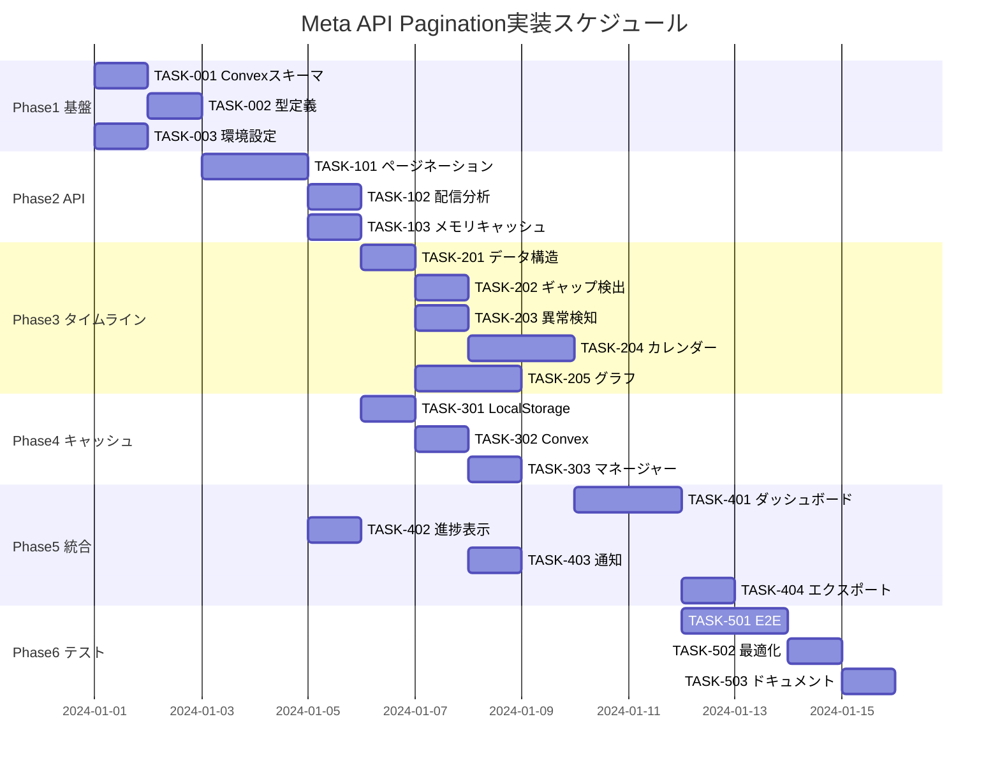

# Meta API Pagination 実装タスク

## 概要

全タスク数: 24
推定作業時間: 120時間（約3週間）
クリティカルパス: TASK-001 → TASK-002 → TASK-101 → TASK-102 → TASK-201 → TASK-301

## タスク一覧

### フェーズ1: 基盤構築（推定: 24時間）

#### TASK-001: Convexデータベーススキーマ設定

- [ ] **タスク完了**
- **タスクタイプ**: DIRECT
- **要件リンク**: REQ-001, REQ-401
- **依存タスク**: なし
- **実装詳細**:
  - Convexスキーマファイルの作成
  - `data_retrieval_history`テーブル定義
  - `api_call_details`テーブル定義
  - `delivery_pattern_analysis`テーブル定義
  - インデックス設定
- **テスト要件**:
  - [ ] スキーマ検証テスト
  - [ ] Convex接続テスト
  - [ ] 基本CRUD操作テスト
- **完了条件**:
  - [ ] 全テーブルがConvexに作成されている
  - [ ] インデックスが正しく設定されている
  - [ ] データの読み書きが可能

#### TASK-002: TypeScript型定義の統合

- [ ] **タスク完了**
- **タスクタイプ**: DIRECT
- **要件リンク**: REQ-002
- **依存タスク**: TASK-001
- **実装詳細**:
  - `interfaces.ts`の既存プロジェクトへの統合
  - `timeline-interfaces.ts`の統合
  - 既存型定義との整合性確認
  - 型ガード関数の実装
- **テスト要件**:
  - [ ] TypeScriptビルドエラーなし
  - [ ] 型推論が正しく動作
- **完了条件**:
  - [ ] すべての型定義が利用可能
  - [ ] 既存コードとの競合なし

#### TASK-003: 環境設定と定数定義

- [ ] **タスク完了**
- **タスクタイプ**: DIRECT
- **要件リンク**: REQ-003
- **依存タスク**: なし
- **実装詳細**:
  - 環境変数設定（`.env`ファイル）
  - Meta API設定（アクセストークン、バージョン）
  - キャッシュ設定定数
  - エラーしきい値定数
- **テスト要件**:
  - [ ] 環境変数読み込みテスト
  - [ ] デフォルト値フォールバック確認
- **完了条件**:
  - [ ] 全環境変数が設定されている
  - [ ] 設定値が正しく読み込まれる

### フェーズ2: コアAPI実装（推定: 32時間）

#### TASK-101: 完全ページネーション処理の実装

- [ ] **タスク完了**
- **タスクタイプ**: TDD
- **要件リンク**: REQ-101, REQ-102, REQ-103
- **依存タスク**: TASK-002
- **実装詳細**:
  - `fetchPaginatedData`関数の実装
  - `while (response.paging?.next)`ループ処理
  - 進捗トラッキング機能
  - エラーハンドリング（3回リトライ）
  - レート制限対応（429エラー）
- **テスト要件**:
  - [ ] 単体テスト: ページネーションロジック
  - [ ] 統合テスト: 完全データ取得
  - [ ] エラーケーステスト: ネットワークエラー、レート制限
- **エラーハンドリング**:
  - [ ] ネットワークエラー時のリトライ
  - [ ] レート制限時の待機処理
  - [ ] 部分的成功の処理
- **完了条件**:
  - [ ] 100ページ以上のデータを取得可能
  - [ ] 進捗状況がリアルタイム表示
  - [ ] エラー時の適切なリカバリ

#### TASK-102: 配信日数分析ロジック

- [ ] **タスク完了**
- **タスクタイプ**: TDD
- **要件リンク**: REQ-104, REQ-105
- **依存タスク**: TASK-101
- **実装詳細**:
  - `analyzeDeliveryDays`関数の実装
  - 実配信日数のカウント
  - 配信パターンの判定（continuous/partial/intermittent）
  - カバレッジ率の計算
- **テスト要件**:
  - [ ] 単体テスト: 配信日数カウント
  - [ ] パターン判定テスト
  - [ ] エッジケーステスト: 0日配信、全日配信
- **完了条件**:
  - [ ] 正確な配信日数が取得できる
  - [ ] 配信パターンが正しく判定される

#### TASK-103: メモリキャッシュ基本実装

- [ ] **タスク完了**
- **タスクタイプ**: TDD
- **要件リンク**: REQ-201
- **依存タスク**: TASK-101
- **実装詳細**:
  - `MemoryCache`クラスの実装
  - TTL管理（5分）
  - キャッシュキー生成ロジック
  - サイズ制限（50MB）
  - LRUエビクション
- **テスト要件**:
  - [ ] 単体テスト: キャッシュ読み書き
  - [ ] TTL期限切れテスト
  - [ ] メモリ制限テスト
- **完了条件**:
  - [ ] キャッシュヒット率測定可能
  - [ ] TTLが正しく動作
  - [ ] メモリ使用量が制限内

### フェーズ3: タイムライン機能（推定: 32時間）

#### TASK-201: タイムラインデータ構造の実装

- [ ] **タスク完了**
- **タスクタイプ**: TDD
- **要件リンク**: REQ-301
- **依存タスク**: TASK-102
- **実装詳細**:
  - `DailyDeliveryStatus`クラスの実装
  - `TimelineData`構造体の実装
  - メトリクス集計ロジック
  - 比較フラグの計算
- **テスト要件**:
  - [ ] 単体テスト: データ構造の整合性
  - [ ] 集計ロジックテスト
  - [ ] パフォーマンステスト: 大量データ処理
- **完了条件**:
  - [ ] 30日分のデータを処理可能
  - [ ] メトリクスが正確に集計される

#### TASK-202: ギャップ検出エンジン

- [ ] **タスク完了**
- **タスクタイプ**: TDD
- **要件リンク**: REQ-302, REQ-303
- **依存タスク**: TASK-201
- **実装詳細**:
  - `GapDetector`クラスの実装
  - ギャップ期間の特定
  - 重要度判定（minor/major/critical）
  - 原因推定ロジック（5パターン）
- **テスト要件**:
  - [ ] 単体テスト: ギャップ検出精度
  - [ ] 原因推定テスト: 各パターンの検証
  - [ ] 境界値テスト
- **完了条件**:
  - [ ] 1日以上のギャップを100%検出
  - [ ] 原因推定精度80%以上

#### TASK-203: 基本異常検知の実装

- [ ] **タスク完了**
- **タスクタイプ**: TDD
- **要件リンク**: REQ-304
- **依存タスク**: TASK-201
- **実装詳細**:
  - `AnomalyDetector`クラスの実装
  - 3つの基本パターン検出
    - sudden_stop: 3日以上配信停止
    - high_frequency: > 3.5
    - ctr_drop: < baseline * 0.75
  - しきい値設定
- **テスト要件**:
  - [ ] 単体テスト: 各異常パターン検出
  - [ ] 統合テスト: 複合異常の検出
  - [ ] 誤検知率テスト
- **完了条件**:
  - [ ] 検出精度90%以上
  - [ ] 誤検知率5%以下

#### TASK-204: カレンダービューコンポーネント

- [ ] **タスク完了**
- **タスクタイプ**: TDD
- **要件リンク**: REQ-305
- **依存タスク**: TASK-201, TASK-202, TASK-203
- **実装詳細**:
  - `TimelineCalendar`コンポーネント
  - 日別セルの描画
  - 配信強度のカラーマッピング
  - ギャップ・異常の視覚化
  - ツールチップ表示
- **UI/UX要件**:
  - [ ] ローディング状態: スケルトンカレンダー表示
  - [ ] エラー表示: インラインエラーメッセージ
  - [ ] モバイル対応: 横スクロール対応
  - [ ] アクセシビリティ: ARIA属性、キーボードナビゲーション
  - [ ] アニメーション: セル選択時のトランジション
- **テスト要件**:
  - [ ] コンポーネントテスト: 描画確認
  - [ ] インタラクションテスト: クリック、ホバー
  - [ ] レスポンシブテスト: 各画面サイズ
- **完了条件**:
  - [ ] 30日分のカレンダー表示
  - [ ] 配信状態の色分け表示
  - [ ] ギャップ・異常のハイライト

#### TASK-205: タイムライングラフコンポーネント

- [ ] **タスク完了**
- **タスクタイプ**: TDD
- **要件リンク**: REQ-306
- **依存タスク**: TASK-201
- **実装詳細**:
  - `TimelineChart`コンポーネント（Recharts使用）
  - 折れ線グラフ（CTR、CPM、Frequency）
  - ギャップ期間のシェード表示
  - 異常点のマーカー表示
  - ズーム・パン機能
- **UI/UX要件**:
  - [ ] ローディング状態: プレースホルダーチャート
  - [ ] エラー表示: データ取得失敗メッセージ
  - [ ] モバイル対応: タッチジェスチャー対応
  - [ ] アクセシビリティ: グラフデータのテキスト代替
  - [ ] インタラクティブ: ホバーで詳細表示
- **テスト要件**:
  - [ ] 描画テスト: 正確なデータプロット
  - [ ] インタラクションテスト: ズーム、パン
  - [ ] パフォーマンステスト: 大量データ時
- **完了条件**:
  - [ ] 30日分のデータをグラフ化
  - [ ] ギャップ・異常が視覚的に識別可能
  - [ ] スムーズなインタラクション

### フェーズ4: キャッシュ最適化（推定: 16時間）

#### TASK-301: LocalStorageキャッシュ層

- [ ] **タスク完了**
- **タスクタイプ**: TDD
- **要件リンク**: REQ-202
- **依存タスク**: TASK-103
- **実装詳細**:
  - `LocalStorageCache`クラスの実装
  - 可変TTL（1-24時間）
  - データ圧縮（LZ-string）
  - サイズ管理（500MB制限）
  - 古いデータの自動削除
- **テスト要件**:
  - [ ] 単体テスト: 永続化確認
  - [ ] サイズ制限テスト
  - [ ] ブラウザ互換性テスト
- **完了条件**:
  - [ ] ブラウザリロード後もキャッシュ有効
  - [ ] ストレージ使用量が制限内

#### TASK-302: Convexキャッシュ層

- [ ] **タスク完了**
- **タスクタイプ**: TDD
- **要件リンク**: REQ-203
- **依存タスク**: TASK-001, TASK-301
- **実装詳細**:
  - `ConvexCache`クラスの実装
  - Convexクエリ・ミューテーション
  - 差分更新メカニズム
  - バッチ処理最適化
- **テスト要件**:
  - [ ] 統合テスト: Convex読み書き
  - [ ] 差分更新テスト
  - [ ] 同時実行テスト
- **完了条件**:
  - [ ] 長期データの永続化
  - [ ] 差分更新が正しく動作

#### TASK-303: 3層キャッシュマネージャー

- [ ] **タスク完了**
- **タスクタイプ**: TDD
- **要件リンク**: REQ-204, REQ-205
- **依存タスク**: TASK-103, TASK-301, TASK-302
- **実装詳細**:
  - `CacheManager`クラスの実装
  - 階層的キャッシュ検索
  - 自動層選択ロジック
  - キャッシュ統計収集
  - キャッシュ無効化戦略
- **テスト要件**:
  - [ ] 統合テスト: 3層動作確認
  - [ ] パフォーマンステスト: キャッシュヒット率
  - [ ] フォールバックテスト
- **完了条件**:
  - [ ] キャッシュヒット率70%以上
  - [ ] 適切な層からのデータ取得

### フェーズ5: 統合とUI実装（推定: 16時間）

#### TASK-401: メインダッシュボードの統合

- [ ] **タスク完了**
- **タスクタイプ**: TDD
- **要件リンク**: REQ-401, REQ-402
- **依存タスク**: TASK-204, TASK-205, TASK-303
- **実装詳細**:
  - `MetaApiDashboard`コンポーネント
  - データ取得状態管理（TanStack Query）
  - タブ切り替え（カレンダー/グラフ/テーブル）
  - フィルター機能
  - エクスポート機能
- **UI/UX要件**:
  - [ ] ローディング状態: 全体スケルトン
  - [ ] エラー表示: エラーバウンダリ
  - [ ] モバイル対応: レスポンシブレイアウト
  - [ ] アクセシビリティ: フォーカス管理
  - [ ] パフォーマンス: 仮想化スクロール
- **テスト要件**:
  - [ ] E2Eテスト: ユーザーフロー
  - [ ] パフォーマンステスト: 初回ロード時間
  - [ ] アクセシビリティテスト
- **完了条件**:
  - [ ] 初回ロード3秒以内
  - [ ] キャッシュ時500ms以内
  - [ ] 全機能が統合されている

#### TASK-402: 進捗表示とフィードバック

- [ ] **タスク完了**
- **タスクタイプ**: TDD
- **要件リンク**: REQ-403
- **依存タスク**: TASK-101
- **実装詳細**:
  - `ProgressIndicator`コンポーネント
  - リアルタイム進捗バー
  - 「X/Yページ取得中」表示
  - 推定残り時間
  - キャンセル機能
- **UI/UX要件**:
  - [ ] アニメーション: スムーズな進捗更新
  - [ ] 視認性: 明確な進捗表示
  - [ ] インタラクティブ: キャンセルボタン
- **テスト要件**:
  - [ ] コンポーネントテスト
  - [ ] キャンセル機能テスト
- **完了条件**:
  - [ ] リアルタイム進捗表示
  - [ ] 正確な残り時間推定

#### TASK-403: 異常通知システム

- [ ] **タスク完了**
- **タスクタイプ**: TDD
- **要件リンク**: REQ-404
- **依存タスク**: TASK-203
- **実装詳細**:
  - `NotificationManager`クラス
  - トースト通知コンポーネント
  - 異常検出時の自動通知
  - 通知履歴管理
  - 通知設定UI
- **UI/UX要件**:
  - [ ] 非侵襲的: トースト形式
  - [ ] 優先度別表示: 色分け、アイコン
  - [ ] アクション可能: 詳細表示リンク
  - [ ] 履歴表示: 通知ドロワー
- **テスト要件**:
  - [ ] 通知表示テスト
  - [ ] 優先度別処理テスト
- **完了条件**:
  - [ ] 異常検出時の即座通知
  - [ ] 通知履歴の保存

#### TASK-404: データエクスポート機能

- [ ] **タスク完了**
- **タスクタイプ**: TDD
- **要件リンク**: REQ-405
- **依存タスク**: TASK-401
- **実装詳細**:
  - CSV/JSON/PDFエクスポート
  - 期間選択機能
  - カスタムフィールド選択
  - バッチエクスポート
- **UI/UX要件**:
  - [ ] プログレス表示: エクスポート進捗
  - [ ] プレビュー機能: エクスポート前確認
  - [ ] 設定保存: エクスポート設定記憶
- **テスト要件**:
  - [ ] 各形式のエクスポートテスト
  - [ ] 大量データエクスポートテスト
- **完了条件**:
  - [ ] 3形式でのエクスポート可能
  - [ ] 10万行以上のデータ処理可能

### フェーズ6: テストと最適化（推定: 16時間）

#### TASK-501: E2Eテストスイート

- [ ] **タスク完了**
- **タスクタイプ**: TDD
- **要件リンク**: 全要件
- **依存タスク**: TASK-401
- **実装詳細**:
  - Playwrightセットアップ
  - 主要ユーザーフローテスト
  - エラーケーステスト
  - パフォーマンステスト
- **テスト要件**:
  - [ ] データ取得フロー
  - [ ] キャッシュ動作確認
  - [ ] 異常検知フロー
- **完了条件**:
  - [ ] カバレッジ80%以上
  - [ ] 全主要フロー網羅

#### TASK-502: パフォーマンス最適化

- [ ] **タスク完了**
- **タスクタイプ**: DIRECT
- **要件リンク**: REQ-501
- **依存タスク**: TASK-501
- **実装詳細**:
  - バンドルサイズ最適化
  - コード分割
  - 遅延ロード実装
  - メモリリーク修正
- **テスト要件**:
  - [ ] Lighthouseスコア測定
  - [ ] メモリプロファイリング
- **完了条件**:
  - [ ] Lighthouseスコア90以上
  - [ ] バンドルサイズ500KB以下

#### TASK-503: ドキュメント作成

- [ ] **タスク完了**
- **タスクタイプ**: DIRECT
- **要件リンク**: REQ-502
- **依存タスク**: TASK-502
- **実装詳細**:
  - APIドキュメント
  - ユーザーガイド
  - トラブルシューティング
  - 運用マニュアル
- **完了条件**:
  - [ ] 全機能のドキュメント化
  - [ ] サンプルコード付き

## 実行順序

## サブタスク実行プロセス

### TDDタスクの場合

各TDDタスクは以下のプロセスで実装:

1. **tdd-requirements.md** - 詳細要件定義
2. **tdd-testcases.md** - テストケース作成  
3. **tdd-red.md** - テスト実装（失敗）
4. **tdd-green.md** - 最小実装
5. **tdd-refactor.md** - リファクタリング
6. **tdd-verify-complete.md** - 品質確認

### DIRECTタスクの場合

各DIRECTタスクは以下のプロセスで実装:

1. **direct-setup.md** - 直接実装・設定
2. **direct-verify.md** - 動作確認・品質確認

## 優先実装推奨事項

### クリティカルパス（最優先）
1. TASK-001: Convexスキーマ（基盤）
2. TASK-101: ページネーション（コア機能）
3. TASK-201: タイムラインデータ（主要機能）
4. TASK-401: ダッシュボード統合（ユーザー価値）

### 並行実行可能タスク
- TASK-001とTASK-003（基盤設定）
- TASK-102とTASK-103（API機能）
- TASK-204とTASK-205（UI components）
- TASK-402とTASK-403（補助UI）

### 早期価値提供
Phase 1-2完了時点で基本的なデータ取得が可能となり、部分的な本番投入が可能です。

## 実装開始チェックリスト

- [ ] 設計ドキュメントの最終確認
- [ ] 開発環境の準備
- [ ] Meta APIアクセストークンの取得
- [ ] Convex環境のセットアップ
- [ ] チーム内での役割分担
- [ ] CI/CD環境の準備